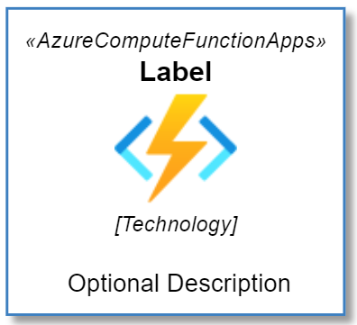
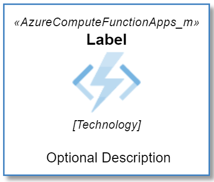

# Azure Icons for PlantUML
This project is reworked fork of [RicardoNiepel/Azure-PlantUML](https://github.com/RicardoNiepel/Azure-PlantUML) with different icon set and build process.

There are several important changes.

- It uses the ['CDS' Azure Icons Set](https://github.com/benc-uk/icon-collection) from the [benc-uk/icon-collection](https://github.com/benc-uk/icon-collection) repository which is much more complete icon collection.
- Macros are not picked from hand written configuration but generated from image names.

## Usage
Put this into your PUML to add support for all images.

```puml
!define AzurePuml https://raw.githubusercontent.com/czmirek/PlantUML-AzureIcons/main/dist
!include AzurePuml/AzureCommon.puml
!include AzurePuml/all.puml
```
Then look into the [macro table](https://github.com/czmirek/PlantUML-AzureIcons/blob/main/table.md) and find whatever you want to add into your PUML in same manner as from the former official library. 

> If you are coming from the former library then **beware, the macros are different**! Read below.

It may be unneccessary to load all icons so you can handpick only what you need.
```puml
!include AzurePuml/AzureComputeFunctionApps.puml
```

For each box there are two variants:
- Colored transparent png image
- Monochromatic sprite

### Colored image
This is the default to use, it loads the png image from the internet.

Macro:
```
AzureComputeFunctionApps(functionAlias2, "Label", "Technology", "Optional Description")
```
Render:



If you wish to use this locally, download this repo and change `IMAGE_SOURCE` in the `AzureCommon.puml` file.

### Monochromatic sprite
This uses generated monochromatic sprites if you wish to use these instead of images.

Macro:
```
AzureComputeFunctionApps_m(functionAlias2, "Label", "Technology", "Optional Description")
```


If you wish to use monochromatic sprites locally, it's enough to download just [AzureCommon.yaml](https://github.com/czmirek/PlantUML-AzureIcons/blob/main/AzureCommon.puml) and [all.yaml](https://github.com/czmirek/PlantUML-AzureIcons/blob/main/dist/all.puml).

## Differences from original repository
### BEWARE: The macros are different!
The macros are [COMPLETELY different](https://github.com/plantuml-stdlib/Azure-PlantUML/blob/master/AzureSymbols.md#azure-symbols) from the original repository! You cannot just replace the header, you need to replace the individual boxes with different calls as well.

> *This is because the macros are automatically generated from the image names of the [image repository](https://github.com/benc-uk/icon-collection/tree/master/azure-cds) while in the former repository they are hand written in a configuration file.*

But the macros signature are still the same, therefore a project wide string replace should make it.

### Difference example:
| Image   | Original macro      | Replace with  |
|----------|-------------|------|
|  |  `AzureFunction` | `AzureComputeFunctionApps` |

### Some functionality is missing
I did not study the former repo in much detail but the Raw and C4 options were removed.

## Building
If you want to rebuild the image collection yourself, you need:
- Powershell core
- [Inkscape](https://inkscape.org/)
- java + [plantuml.jar](https://plantuml.com/download)
- GUI interface - at the time of writting, it was not possible to run the inkscape commands in the terminal only OS.
- time. It's a lot of images and inkscape is slow as hell, but the output is reliable, which cannot be said about `rsvg-convert` which produces broken or corrupted images. It takes approx. 5-10 minutes to generate everything.
- patince: the inkscape command froze once or twice and terminal has to be restarted

Then:
- Add inkscape to your PATH
- Run `build.ps1` script with `plantUmlPath` argument where you provide full path to the `plantuml.jar` file


