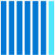
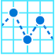
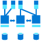
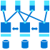
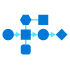
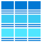
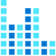
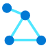

# Azure Patterns macro table
List of PUML macros for the Azure Patterns image repository.
See [README.md](README.md) for more info.

## Colored image 
```
APSomeMacro(functionAlias, "Label", "Technology", "Optional description")
```
## Monochromatic sprite
```
APSomeMacro_m(functionAlias, "Label", "Technology", "Optional description")
```
## Include all sprites

Your PUML might take long to render
```
!define AzurePuml https://raw.githubusercontent.com/czmirek/PlantUML-AzureIcons/main/dist
!include AzurePuml/AzureCommon.puml
!include AzurePuml/azure-patterns/all.puml
```
# Categories

## Alert

Macro for including this category
```
!define AzurePuml https://raw.githubusercontent.com/czmirek/PlantUML-AzureIcons/main/dist
!include AzurePuml/AzureCommon.puml
!include AzurePuml/azure-patterns/all.puml
```
Image | Macro
| --- | ---
 | `APAlert01`<br>`APAlert01_m` |
 | `APAlert02`<br>`APAlert02_m` |
 | `APAlert03`<br>`APAlert03_m` |
 | `APAlert04`<br>`APAlert04_m` |
 | `APAlert05`<br>`APAlert05_m` |
 | `APAlert06`<br>`APAlert06_m` |
 | `APAlertBlue`<br>`APAlertBlue_m` |
 | `APAlertExclamation`<br>`APAlertExclamation_m` |


## App

Macro for including this category
```
!define AzurePuml https://raw.githubusercontent.com/czmirek/PlantUML-AzureIcons/main/dist
!include AzurePuml/AzureCommon.puml
!include AzurePuml/azure-patterns/all.puml
```
Image | Macro
| --- | ---
 | `APAppCenter`<br>`APAppCenter_m` |
 | `APAppCenterMono`<br>`APAppCenterMono_m` |
 | `APApplicationResources`<br>`APApplicationResources_m` |
 | `APApplications`<br>`APApplications_m` |
 | `APApplicationsAndData`<br>`APApplicationsAndData_m` |
 | `APAppServiceApi`<br>`APAppServiceApi_m` |
 | `APAppServiceContainer`<br>`APAppServiceContainer_m` |
 | `APAppServiceLogic`<br>`APAppServiceLogic_m` |
 | `APAppServiceMobile`<br>`APAppServiceMobile_m` |
 | `APAppServiceWeb`<br>`APAppServiceWeb_m` |
 | `APAppServiceWebEpi`<br>`APAppServiceWebEpi_m` |
 | `APAppServiceWebOrchard`<br>`APAppServiceWebOrchard_m` |
 | `APAppServiceWebSitecore`<br>`APAppServiceWebSitecore_m` |


## Arrow

Macro for including this category
```
!define AzurePuml https://raw.githubusercontent.com/czmirek/PlantUML-AzureIcons/main/dist
!include AzurePuml/AzureCommon.puml
!include AzurePuml/azure-patterns/all.puml
```
Image | Macro
| --- | ---
 | `APArrow01`<br>`APArrow01_m` |
 | `APArrow02`<br>`APArrow02_m` |
 | `APArrow03`<br>`APArrow03_m` |
 | `APArrow04`<br>`APArrow04_m` |
 | `APArrow05`<br>`APArrow05_m` |
 | `APArrow06`<br>`APArrow06_m` |
 | `APArrow07`<br>`APArrow07_m` |
 | `APArrow08`<br>`APArrow08_m` |
 | `APArrow09`<br>`APArrow09_m` |
 | `APArrow10`<br>`APArrow10_m` |
 | `APArrow11`<br>`APArrow11_m` |
 | `APArrow12`<br>`APArrow12_m` |
 | `APArrow13`<br>`APArrow13_m` |
 | `APArrow14`<br>`APArrow14_m` |
 | `APArrow15`<br>`APArrow15_m` |
 | `APArrow16`<br>`APArrow16_m` |
 | `APArrow17`<br>`APArrow17_m` |
 | `APArrow18`<br>`APArrow18_m` |
 | `APArrow19`<br>`APArrow19_m` |
 | `APArrow20`<br>`APArrow20_m` |
 | `APArrow21`<br>`APArrow21_m` |
 | `APArrow22`<br>`APArrow22_m` |
 | `APArrow23`<br>`APArrow23_m` |
 | `APArrow24`<br>`APArrow24_m` |
 | `APArrow25`<br>`APArrow25_m` |
 | `APArrow26`<br>`APArrow26_m` |
 | `APArrow27`<br>`APArrow27_m` |
 | `APArrow28`<br>`APArrow28_m` |
 | `APArrow29`<br>`APArrow29_m` |
 | `APArrow30`<br>`APArrow30_m` |
 | `APArrow31`<br>`APArrow31_m` |
 | `APArrow32`<br>`APArrow32_m` |
 | `APArrow33`<br>`APArrow33_m` |
 | `APArrow34`<br>`APArrow34_m` |
 | `APArrow35`<br>`APArrow35_m` |
 | `APArrow36`<br>`APArrow36_m` |
 | `APArrow37`<br>`APArrow37_m` |
 | `APArrow38`<br>`APArrow38_m` |
 | `APArrow39`<br>`APArrow39_m` |
 | `APArrowDown`<br>`APArrowDown_m` |
 | `APArrowGear`<br>`APArrowGear_m` |
 | `APArrowInBullseye`<br>`APArrowInBullseye_m` |
 | `APArrowInBullseyeBlueBg`<br>`APArrowInBullseyeBlueBg_m` |
 | `APArrowOnTarget`<br>`APArrowOnTarget_m` |
 | `APArrows08`<br>`APArrows08_m` |
 | `APArrowScreenCloud`<br>`APArrowScreenCloud_m` |
 | `APArrowsKeyRight`<br>`APArrowsKeyRight_m` |
 | `APArrowUpFill`<br>`APArrowUpFill_m` |
 | `APArrowWithMeter`<br>`APArrowWithMeter_m` |
 | `APArrowWithSquare`<br>`APArrowWithSquare_m` |
 | `APArrowWithSquares`<br>`APArrowWithSquares_m` |


## Audio

Macro for including this category
```
!define AzurePuml https://raw.githubusercontent.com/czmirek/PlantUML-AzureIcons/main/dist
!include AzurePuml/AzureCommon.puml
!include AzurePuml/azure-patterns/all.puml
```
Image | Macro
| --- | ---
 | `APAudioMicrophone`<br>`APAudioMicrophone_m` |
 | `APAudioPlay`<br>`APAudioPlay_m` |
 | `APAudioStop`<br>`APAudioStop_m` |


## Avere

Macro for including this category
```
!define AzurePuml https://raw.githubusercontent.com/czmirek/PlantUML-AzureIcons/main/dist
!include AzurePuml/AzureCommon.puml
!include AzurePuml/azure-patterns/all.puml
```
Image | Macro
| --- | ---
 | `APAvereVfxt`<br>`APAvereVfxt_m` |
 | `APAvereVfxtBlue`<br>`APAvereVfxtBlue_m` |
 | `APAvereVfxtDark`<br>`APAvereVfxtDark_m` |
 | `APAvereVfxtGray`<br>`APAvereVfxtGray_m` |


## Azure

Macro for including this category
```
!define AzurePuml https://raw.githubusercontent.com/czmirek/PlantUML-AzureIcons/main/dist
!include AzurePuml/AzureCommon.puml
!include AzurePuml/azure-patterns/all.puml
```
Image | Macro
| --- | ---
 | `APAzure`<br>`APAzure_m` |
 | `APAzureArtifacts`<br>`APAzureArtifacts_m` |
 | `APAzureBackup`<br>`APAzureBackup_m` |
 | `APAzureBastion`<br>`APAzureBastion_m` |
 | `APAzureBlue`<br>`APAzureBlue_m` |
 | `APAzureBoards`<br>`APAzureBoards_m` |
 | `APAzureCli`<br>`APAzureCli_m` |
 | `APAzureCloud`<br>`APAzureCloud_m` |
 | `APAzureCyclecloud`<br>`APAzureCyclecloud_m` |
 | `APAzureDedicatedHsm`<br>`APAzureDedicatedHsm_m` |
 | `APAzureFirewall01`<br>`APAzureFirewall01_m` |
 | `APAzureHdinsight`<br>`APAzureHdinsight_m` |
 | `APAzureMonitor`<br>`APAzureMonitor_m` |
 | `APAzurePipelines`<br>`APAzurePipelines_m` |
 | `APAzureRepos`<br>`APAzureRepos_m` |
 | `APAzureResourceGroupBlue`<br>`APAzureResourceGroupBlue_m` |
 | `APAzureResourceManager`<br>`APAzureResourceManager_m` |
 | `APAzureStackHci`<br>`APAzureStackHci_m` |
 | `APAzureTestPlans`<br>`APAzureTestPlans_m` |


## Bar

Macro for including this category
```
!define AzurePuml https://raw.githubusercontent.com/czmirek/PlantUML-AzureIcons/main/dist
!include AzurePuml/AzureCommon.puml
!include AzurePuml/azure-patterns/all.puml
```
Image | Macro
| --- | ---
 | `APBarGraph`<br>`APBarGraph_m` |
 | `APBarGraphHuman`<br>`APBarGraphHuman_m` |
 | `APBargraphWithDollarSign`<br>`APBargraphWithDollarSign_m` |
 | `APBarChart`<br>`APBarChart_m` |
 | `APBarChartLastFilled`<br>`APBarChartLastFilled_m` |
 | `APBarChartTwoFilled`<br>`APBarChartTwoFilled_m` |
 | `APBarsWithStar`<br>`APBarsWithStar_m` |
 | `APBarWithSearch`<br>`APBarWithSearch_m` |


## Bing

Macro for including this category
```
!define AzurePuml https://raw.githubusercontent.com/czmirek/PlantUML-AzureIcons/main/dist
!include AzurePuml/AzureCommon.puml
!include AzurePuml/azure-patterns/all.puml
```
Image | Macro
| --- | ---
 | `APBingCustomSearchApi`<br>`APBingCustomSearchApi_m` |
 | `APBingEntitySearchApi`<br>`APBingEntitySearchApi_m` |
 | `APBingImageSearchApi`<br>`APBingImageSearchApi_m` |
 | `APBingLocalBusinessSearch`<br>`APBingLocalBusinessSearch_m` |
 | `APBingNewsSearchApi`<br>`APBingNewsSearchApi_m` |
 | `APBingVideoSearchApi`<br>`APBingVideoSearchApi_m` |
 | `APBingVisualSearch`<br>`APBingVisualSearch_m` |


## Blockchain

Macro for including this category
```
!define AzurePuml https://raw.githubusercontent.com/czmirek/PlantUML-AzureIcons/main/dist
!include AzurePuml/AzureCommon.puml
!include AzurePuml/azure-patterns/all.puml
```
Image | Macro
| --- | ---
 | `APBlockchain`<br>`APBlockchain_m` |
 | `APBlockchainService`<br>`APBlockchainService_m` |
 | `APBlockchainTokens`<br>`APBlockchainTokens_m` |
 | `APBlockchainTools`<br>`APBlockchainTools_m` |
 | `APBlockchainWorkbench`<br>`APBlockchainWorkbench_m` |
 | `APBlockchainWorkbenchAlt`<br>`APBlockchainWorkbenchAlt_m` |


## Bluesquare

Macro for including this category
```
!define AzurePuml https://raw.githubusercontent.com/czmirek/PlantUML-AzureIcons/main/dist
!include AzurePuml/AzureCommon.puml
!include AzurePuml/azure-patterns/all.puml
```
Image | Macro
| --- | ---
 | `APBlueSquareHollowSquare`<br>`APBlueSquareHollowSquare_m` |
 | `APBlueSquareLightblueSquare`<br>`APBlueSquareLightblueSquare_m` |
 | `APBlueSquareLightblueSquareAlt`<br>`APBlueSquareLightblueSquareAlt_m` |
 | `APBlueSquares`<br>`APBlueSquares_m` |
 | `APBlueSquaresAndArrows`<br>`APBlueSquaresAndArrows_m` |
 | `APBlueSquaresDiagonalArrow`<br>`APBlueSquaresDiagonalArrow_m` |
 | `APBlueSquaresRectangle`<br>`APBlueSquaresRectangle_m` |
 | `APBlueSquaresRectangleAlt`<br>`APBlueSquaresRectangleAlt_m` |


## Book

Macro for including this category
```
!define AzurePuml https://raw.githubusercontent.com/czmirek/PlantUML-AzureIcons/main/dist
!include AzurePuml/AzureCommon.puml
!include AzurePuml/azure-patterns/all.puml
```
Image | Macro
| --- | ---
 | `APBook`<br>`APBook_m` |
 | `APBookAlt`<br>`APBookAlt_m` |
 | `APBookAltDark`<br>`APBookAltDark_m` |
 | `APBookAltV2`<br>`APBookAltV2_m` |
 | `APBookBlue`<br>`APBookBlue_m` |
 | `APBookGrey`<br>`APBookGrey_m` |
 | `APBookmark`<br>`APBookmark_m` |
 | `APBookOpen`<br>`APBookOpen_m` |
 | `APBookOpenAlt`<br>`APBookOpenAlt_m` |


## Browser

Macro for including this category
```
!define AzurePuml https://raw.githubusercontent.com/czmirek/PlantUML-AzureIcons/main/dist
!include AzurePuml/AzureCommon.puml
!include AzurePuml/azure-patterns/all.puml
```
Image | Macro
| --- | ---
 | `APBrowser`<br>`APBrowser_m` |
 | `APBrowserChart`<br>`APBrowserChart_m` |
 | `APBrowserNetwork`<br>`APBrowserNetwork_m` |
 | `APBrowserPerson`<br>`APBrowserPerson_m` |
 | `APBrowserSettings`<br>`APBrowserSettings_m` |
 | `APBrowserVm`<br>`APBrowserVm_m` |


## Build

Macro for including this category
```
!define AzurePuml https://raw.githubusercontent.com/czmirek/PlantUML-AzureIcons/main/dist
!include AzurePuml/AzureCommon.puml
!include AzurePuml/azure-patterns/all.puml
```
Image | Macro
| --- | ---
 | `APBuild`<br>`APBuild_m` |
 | `APBuild01`<br>`APBuild01_m` |
 | `APBuild02`<br>`APBuild02_m` |
 | `APBuild03`<br>`APBuild03_m` |
 | `APBuild04`<br>`APBuild04_m` |
 | `APBuild05`<br>`APBuild05_m` |
 | `APBuild06`<br>`APBuild06_m` |
 | `APBuild07`<br>`APBuild07_m` |
 | `APBuild08`<br>`APBuild08_m` |
 | `APBuild09`<br>`APBuild09_m` |
 | `APBuild10`<br>`APBuild10_m` |
 | `APBuild11`<br>`APBuild11_m` |
 | `APBuild12`<br>`APBuild12_m` |
 | `APBuild13`<br>`APBuild13_m` |
 | `APBuild14`<br>`APBuild14_m` |
 | `APBuild15`<br>`APBuild15_m` |
 | `APBuild16`<br>`APBuild16_m` |
 | `APBuild17`<br>`APBuild17_m` |
 | `APBuild18`<br>`APBuild18_m` |
 | `APBuild19`<br>`APBuild19_m` |
 | `APBuild20`<br>`APBuild20_m` |
 | `APBuild21`<br>`APBuild21_m` |
 | `APBuild22`<br>`APBuild22_m` |
 | `APBuilding01`<br>`APBuilding01_m` |
 | `APBuilding02`<br>`APBuilding02_m` |
 | `APBuilding03`<br>`APBuilding03_m` |
 | `APBuilding04`<br>`APBuilding04_m` |
 | `APBuilding05`<br>`APBuilding05_m` |
 | `APBuilding06`<br>`APBuilding06_m` |
 | `APBuilding07`<br>`APBuilding07_m` |
 | `APBuilding08`<br>`APBuilding08_m` |
 | `APBuilding09`<br>`APBuilding09_m` |
 | `APBuilding10`<br>`APBuilding10_m` |
 | `APBuilding11`<br>`APBuilding11_m` |
 | `APBuilding12`<br>`APBuilding12_m` |
 | `APBuilding13`<br>`APBuilding13_m` |
 | `APBuilding14`<br>`APBuilding14_m` |
 | `APBuilding15`<br>`APBuilding15_m` |
 | `APBuilding16`<br>`APBuilding16_m` |
 | `APBuilding17`<br>`APBuilding17_m` |
 | `APBuilding18`<br>`APBuilding18_m` |
 | `APBuilding19`<br>`APBuilding19_m` |
 | `APBuilding20`<br>`APBuilding20_m` |
 | `APBuilding21`<br>`APBuilding21_m` |
 | `APBuilding22`<br>`APBuilding22_m` |
 | `APBuilding23`<br>`APBuilding23_m` |
 | `APBuilding24`<br>`APBuilding24_m` |
 | `APBuilding25`<br>`APBuilding25_m` |
 | `APBuilding26`<br>`APBuilding26_m` |
 | `APBuildings`<br>`APBuildings_m` |
 | `APBuildingsBlue`<br>`APBuildingsBlue_m` |
 | `APBuildingsCloud`<br>`APBuildingsCloud_m` |
 | `APBuildingsCloudAlt`<br>`APBuildingsCloudAlt_m` |
 | `APBuildingsCloudBlue`<br>`APBuildingsCloudBlue_m` |
 | `APBuildingsHalfCircle`<br>`APBuildingsHalfCircle_m` |
 | `APBuildTool`<br>`APBuildTool_m` |


## Calculator

Macro for including this category
```
!define AzurePuml https://raw.githubusercontent.com/czmirek/PlantUML-AzureIcons/main/dist
!include AzurePuml/AzureCommon.puml
!include AzurePuml/azure-patterns/all.puml
```
Image | Macro
| --- | ---
 | `APCalculator`<br>`APCalculator_m` |
 | `APCalculator01`<br>`APCalculator01_m` |
 | `APCalculator02`<br>`APCalculator02_m` |
 | `APCalculator03`<br>`APCalculator03_m` |
 | `APCalculator04`<br>`APCalculator04_m` |
 | `APCalculatorCollapse`<br>`APCalculatorCollapse_m` |
 | `APCalculatorCopy`<br>`APCalculatorCopy_m` |
 | `APCalculatorDelete`<br>`APCalculatorDelete_m` |
 | `APCalculatorDocument`<br>`APCalculatorDocument_m` |
 | `APCalculatorError`<br>`APCalculatorError_m` |
 | `APCalculatorExcel`<br>`APCalculatorExcel_m` |
 | `APCalculatorExpand`<br>`APCalculatorExpand_m` |
 | `APCalculatorInformation`<br>`APCalculatorInformation_m` |
 | `APCalculatorInvite`<br>`APCalculatorInvite_m` |
 | `APCalculatorNoteInformation`<br>`APCalculatorNoteInformation_m` |
 | `APCalculatorPricingDetails`<br>`APCalculatorPricingDetails_m` |
 | `APCalculatorSave`<br>`APCalculatorSave_m` |
 | `APCalculatorSaveAs`<br>`APCalculatorSaveAs_m` |
 | `APCalculatorShare`<br>`APCalculatorShare_m` |


## Calendar

Macro for including this category
```
!define AzurePuml https://raw.githubusercontent.com/czmirek/PlantUML-AzureIcons/main/dist
!include AzurePuml/AzureCommon.puml
!include AzurePuml/azure-patterns/all.puml
```
Image | Macro
| --- | ---
 | `APCalendar`<br>`APCalendar_m` |
 | `APCalendar12`<br>`APCalendar12_m` |
 | `APCalendarAlt`<br>`APCalendarAlt_m` |
 | `APCalendarAltBlue`<br>`APCalendarAltBlue_m` |
 | `APCalendarBlue`<br>`APCalendarBlue_m` |


## Calender

Macro for including this category
```
!define AzurePuml https://raw.githubusercontent.com/czmirek/PlantUML-AzureIcons/main/dist
!include AzurePuml/AzureCommon.puml
!include AzurePuml/azure-patterns/all.puml
```
Image | Macro
| --- | ---
 | `APCalender01`<br>`APCalender01_m` |
 | `APCalender02`<br>`APCalender02_m` |
 | `APCalender03`<br>`APCalender03_m` |
 | `APCalender04`<br>`APCalender04_m` |
 | `APCalender05`<br>`APCalender05_m` |
 | `APCalender06`<br>`APCalender06_m` |


## Circle

Macro for including this category
```
!define AzurePuml https://raw.githubusercontent.com/czmirek/PlantUML-AzureIcons/main/dist
!include AzurePuml/AzureCommon.puml
!include AzurePuml/azure-patterns/all.puml
```
Image | Macro
| --- | ---
 | `APCircleBar`<br>`APCircleBar_m` |
 | `APCircleCloud`<br>`APCircleCloud_m` |
 | `APCircleCloudAlt`<br>`APCircleCloudAlt_m` |
 | `APCircleCheck`<br>`APCircleCheck_m` |
 | `APCircleInsideCircles`<br>`APCircleInsideCircles_m` |
 | `APCircleLightning`<br>`APCircleLightning_m` |
 | `APCircleLocation`<br>`APCircleLocation_m` |
 | `APCircleMeter`<br>`APCircleMeter_m` |
 | `APCircleMoney`<br>`APCircleMoney_m` |
 | `APCircleMoneyAlt`<br>`APCircleMoneyAlt_m` |
 | `APCircleMoneyBlue`<br>`APCircleMoneyBlue_m` |
 | `APCircleMoneyTwo`<br>`APCircleMoneyTwo_m` |
 | `APCircleMoneyTwoAlt`<br>`APCircleMoneyTwoAlt_m` |
 | `APCircleSquareConvert`<br>`APCircleSquareConvert_m` |
 | `APCirclesRamp`<br>`APCirclesRamp_m` |
 | `APCirclesRampBlue`<br>`APCirclesRampBlue_m` |
 | `APCirclesTwoBlue`<br>`APCirclesTwoBlue_m` |
 | `APCircleUser`<br>`APCircleUser_m` |
 | `APCircleUserAlt`<br>`APCircleUserAlt_m` |


## Clock

Macro for including this category
```
!define AzurePuml https://raw.githubusercontent.com/czmirek/PlantUML-AzureIcons/main/dist
!include AzurePuml/AzureCommon.puml
!include AzurePuml/azure-patterns/all.puml
```
Image | Macro
| --- | ---
 | `APClockBlue`<br>`APClockBlue_m` |
 | `APClockBlueAlt`<br>`APClockBlueAlt_m` |
 | `APClockGrey`<br>`APClockGrey_m` |
 | `APClockMoving`<br>`APClockMoving_m` |
 | `APClockTwoToneArrow`<br>`APClockTwoToneArrow_m` |


## Cloud

Macro for including this category
```
!define AzurePuml https://raw.githubusercontent.com/czmirek/PlantUML-AzureIcons/main/dist
!include AzurePuml/AzureCommon.puml
!include AzurePuml/azure-patterns/all.puml
```
Image | Macro
| --- | ---
 | `APCloud`<br>`APCloud_m` |
 | `APCloud01`<br>`APCloud01_m` |
 | `APCloud02`<br>`APCloud02_m` |
 | `APCloud03`<br>`APCloud03_m` |
 | `APCloud04`<br>`APCloud04_m` |
 | `APCloud05`<br>`APCloud05_m` |
 | `APCloud06`<br>`APCloud06_m` |
 | `APCloud07`<br>`APCloud07_m` |
 | `APCloud08`<br>`APCloud08_m` |
 | `APCloud09`<br>`APCloud09_m` |
 | `APCloud10`<br>`APCloud10_m` |
 | `APCloud11`<br>`APCloud11_m` |
 | `APCloud12`<br>`APCloud12_m` |
 | `APCloud13`<br>`APCloud13_m` |
 | `APCloud14`<br>`APCloud14_m` |
 | `APCloud15`<br>`APCloud15_m` |
 | `APCloud16`<br>`APCloud16_m` |
 | `APCloud17`<br>`APCloud17_m` |
 | `APCloud18`<br>`APCloud18_m` |
 | `APCloudArrow`<br>`APCloudArrow_m` |
 | `APCloudBlue`<br>`APCloudBlue_m` |
 | `APCloudCircleKey`<br>`APCloudCircleKey_m` |
 | `APCloudConnectedServices`<br>`APCloudConnectedServices_m` |
 | `APCloudDarkBlue`<br>`APCloudDarkBlue_m` |
 | `APCloudLightningBlue`<br>`APCloudLightningBlue_m` |
 | `APCloudLink`<br>`APCloudLink_m` |
 | `APCloudLock`<br>`APCloudLock_m` |
 | `APCloudLocked`<br>`APCloudLocked_m` |
 | `APCloudPolicy`<br>`APCloudPolicy_m` |
 | `APCloudSecure`<br>`APCloudSecure_m` |
 | `APCloudServer`<br>`APCloudServer_m` |
 | `APCloudServicesBlue`<br>`APCloudServicesBlue_m` |
 | `APCloudServicesOutline`<br>`APCloudServicesOutline_m` |
 | `APCloudShell`<br>`APCloudShell_m` |
 | `APCloudTwoGears`<br>`APCloudTwoGears_m` |
 | `APCloudUnlock`<br>`APCloudUnlock_m` |
 | `APCloudUnlocked`<br>`APCloudUnlocked_m` |
 | `APCloudWorkload`<br>`APCloudWorkload_m` |


## Code

Macro for including this category
```
!define AzurePuml https://raw.githubusercontent.com/czmirek/PlantUML-AzureIcons/main/dist
!include AzurePuml/AzureCommon.puml
!include AzurePuml/azure-patterns/all.puml
```
Image | Macro
| --- | ---
 | `APCode`<br>`APCode_m` |
 | `APCode01`<br>`APCode01_m` |
 | `APCode02`<br>`APCode02_m` |
 | `APCode03`<br>`APCode03_m` |
 | `APCode04`<br>`APCode04_m` |
 | `APCode05`<br>`APCode05_m` |
 | `APCode06`<br>`APCode06_m` |
 | `APCode07`<br>`APCode07_m` |
 | `APCode08`<br>`APCode08_m` |
 | `APCode09`<br>`APCode09_m` |
 | `APCode10`<br>`APCode10_m` |
 | `APCode11`<br>`APCode11_m` |
 | `APCode12`<br>`APCode12_m` |
 | `APCode13`<br>`APCode13_m` |
 | `APCodeAlt`<br>`APCodeAlt_m` |
 | `APCodeBlue`<br>`APCodeBlue_m` |
 | `APCodeBlueAlt`<br>`APCodeBlueAlt_m` |
 | `APCodeGrey`<br>`APCodeGrey_m` |
 | `APCodeCheckmark`<br>`APCodeCheckmark_m` |
 | `APCodeSamples`<br>`APCodeSamples_m` |
 | `APCodeSamplesAlt`<br>`APCodeSamplesAlt_m` |
 | `APCodeWindow`<br>`APCodeWindow_m` |


## Computer

Macro for including this category
```
!define AzurePuml https://raw.githubusercontent.com/czmirek/PlantUML-AzureIcons/main/dist
!include AzurePuml/AzureCommon.puml
!include AzurePuml/azure-patterns/all.puml
```
Image | Macro
| --- | ---
 | `APComputer01`<br>`APComputer01_m` |
 | `APComputer02`<br>`APComputer02_m` |
 | `APComputer03`<br>`APComputer03_m` |
 | `APComputer04`<br>`APComputer04_m` |
 | `APComputer05`<br>`APComputer05_m` |
 | `APComputer06`<br>`APComputer06_m` |
 | `APComputer07`<br>`APComputer07_m` |
 | `APComputer08`<br>`APComputer08_m` |
 | `APComputer09`<br>`APComputer09_m` |
 | `APComputer10`<br>`APComputer10_m` |
 | `APComputer11`<br>`APComputer11_m` |
 | `APComputer12`<br>`APComputer12_m` |
 | `APComputer13`<br>`APComputer13_m` |
 | `APComputer14`<br>`APComputer14_m` |
 | `APComputer15`<br>`APComputer15_m` |
 | `APComputer16`<br>`APComputer16_m` |
 | `APComputerBar`<br>`APComputerBar_m` |
 | `APComputerVision`<br>`APComputerVision_m` |


## Curlybrackets

Macro for including this category
```
!define AzurePuml https://raw.githubusercontent.com/czmirek/PlantUML-AzureIcons/main/dist
!include AzurePuml/AzureCommon.puml
!include AzurePuml/azure-patterns/all.puml
```
Image | Macro
| --- | ---
 | `APCurlyBrackets`<br>`APCurlyBrackets_m` |
 | `APCurlyBracketsBlockchain`<br>`APCurlyBracketsBlockchain_m` |
 | `APCurlyBracketShapes`<br>`APCurlyBracketShapes_m` |


## Currency

Macro for including this category
```
!define AzurePuml https://raw.githubusercontent.com/czmirek/PlantUML-AzureIcons/main/dist
!include AzurePuml/AzureCommon.puml
!include AzurePuml/azure-patterns/all.puml
```
Image | Macro
| --- | ---
 | `APCurrencyGraph`<br>`APCurrencyGraph_m` |
 | `APCurrencyGraphAlt`<br>`APCurrencyGraphAlt_m` |
 | `APCurrencyVariationGraph`<br>`APCurrencyVariationGraph_m` |
 | `APCurrencyVariationGraphAlt`<br>`APCurrencyVariationGraphAlt_m` |


## Data

Macro for including this category
```
!define AzurePuml https://raw.githubusercontent.com/czmirek/PlantUML-AzureIcons/main/dist
!include AzurePuml/AzureCommon.puml
!include AzurePuml/azure-patterns/all.puml
```
Image | Macro
| --- | ---
 | `APData`<br>`APData_m` |
 | `APData01`<br>`APData01_m` |
 | `APData02`<br>`APData02_m` |
 | `APData03`<br>`APData03_m` |
 | `APData04`<br>`APData04_m` |
 | `APData05`<br>`APData05_m` |
 | `APData06`<br>`APData06_m` |
 | `APData07`<br>`APData07_m` |
 | `APData08`<br>`APData08_m` |
 | `APDataAlt`<br>`APDataAlt_m` |
 | `APDatabase`<br>`APDatabase_m` |
 | `APDatabase01`<br>`APDatabase01_m` |
 | `APDatabase02`<br>`APDatabase02_m` |
 | `APDatabase03`<br>`APDatabase03_m` |
 | `APDatabase04`<br>`APDatabase04_m` |
 | `APDatabase05`<br>`APDatabase05_m` |
 | `APDatabase06`<br>`APDatabase06_m` |
 | `APDatabase07`<br>`APDatabase07_m` |
 | `APDatabase08`<br>`APDatabase08_m` |
 | `APDatabase09`<br>`APDatabase09_m` |
 | `APDatabase10`<br>`APDatabase10_m` |
 | `APDatabase11`<br>`APDatabase11_m` |
 | `APDatabase12`<br>`APDatabase12_m` |
 | `APDatabase13`<br>`APDatabase13_m` |
 | `APDatabase14`<br>`APDatabase14_m` |
 | `APDatabase15`<br>`APDatabase15_m` |
 | `APDatabase16`<br>`APDatabase16_m` |
 | `APDatabase17`<br>`APDatabase17_m` |
 | `APDatabase18`<br>`APDatabase18_m` |
 | `APDatabase19`<br>`APDatabase19_m` |
 | `APDatabase20`<br>`APDatabase20_m` |
 | `APDatabase21`<br>`APDatabase21_m` |
 | `APDatabase22`<br>`APDatabase22_m` |
 | `APDatabaseBlue`<br>`APDatabaseBlue_m` |
 | `APDatabaseSync`<br>`APDatabaseSync_m` |
 | `APDataboxData`<br>`APDataboxData_m` |
 | `APDataboxDataDark`<br>`APDataboxDataDark_m` |
 | `APDataboxDisk`<br>`APDataboxDisk_m` |
 | `APDataboxEdge`<br>`APDataboxEdge_m` |
 | `APDataboxEdgeNew`<br>`APDataboxEdgeNew_m` |
 | `APDataboxGateway`<br>`APDataboxGateway_m` |
 | `APDataboxGatewayNew`<br>`APDataboxGatewayNew_m` |
 | `APDataboxHeavy`<br>`APDataboxHeavy_m` |
 | `APDataboxNew`<br>`APDataboxNew_m` |
 | `APDatabricks`<br>`APDatabricks_m` |
 | `APDatacenter`<br>`APDatacenter_m` |
 | `APDatacentersSwiss`<br>`APDatacentersSwiss_m` |
 | `APDataCloud`<br>`APDataCloud_m` |
 | `APDataGraph`<br>`APDataGraph_m` |
 | `APDataLake`<br>`APDataLake_m` |
 | `APDataLakeStore`<br>`APDataLakeStore_m` |
 | `APDataSearch`<br>`APDataSearch_m` |
 | `APDataSheet`<br>`APDataSheet_m` |
 | `APDataTransfers`<br>`APDataTransfers_m` |


## Deploy

Macro for including this category
```
!define AzurePuml https://raw.githubusercontent.com/czmirek/PlantUML-AzureIcons/main/dist
!include AzurePuml/AzureCommon.puml
!include AzurePuml/azure-patterns/all.puml
```
Image | Macro
| --- | ---
 | `APDeploy`<br>`APDeploy_m` |
 | `APDeploy01`<br>`APDeploy01_m` |
 | `APDeploy02`<br>`APDeploy02_m` |
 | `APDeploy03`<br>`APDeploy03_m` |
 | `APDeploy04`<br>`APDeploy04_m` |
 | `APDeploy05`<br>`APDeploy05_m` |
 | `APDeploy06`<br>`APDeploy06_m` |
 | `APDeploy07`<br>`APDeploy07_m` |
 | `APDeploy08`<br>`APDeploy08_m` |
 | `APDeploy09`<br>`APDeploy09_m` |
 | `APDeploy10`<br>`APDeploy10_m` |
 | `APDeploy11`<br>`APDeploy11_m` |
 | `APDeployBlue`<br>`APDeployBlue_m` |


## Devops

Macro for including this category
```
!define AzurePuml https://raw.githubusercontent.com/czmirek/PlantUML-AzureIcons/main/dist
!include AzurePuml/AzureCommon.puml
!include AzurePuml/azure-patterns/all.puml
```
Image | Macro
| --- | ---
 | `APDevopsAddPackages`<br>`APDevopsAddPackages_m` |
 | `APDevopsAdvancedWorkflows`<br>`APDevopsAdvancedWorkflows_m` |
 | `APDevopsCaptureData`<br>`APDevopsCaptureData_m` |
 | `APDevopsCodeSearch`<br>`APDevopsCodeSearch_m` |
 | `APDevopsConnected`<br>`APDevopsConnected_m` |
 | `APDevopsContainersKubernetes`<br>`APDevopsContainersKubernetes_m` |
 | `APDevopsDeployCloud`<br>`APDevopsDeployCloud_m` |
 | `APDevopsExtensible`<br>`APDevopsExtensible_m` |
 | `APDevopsGitClient`<br>`APDevopsGitClient_m` |
 | `APDevopsLanguagePlatform`<br>`APDevopsLanguagePlatform_m` |
 | `APDevopsOpenSource`<br>`APDevopsOpenSource_m` |
 | `APDevopsPackageTypes`<br>`APDevopsPackageTypes_m` |
 | `APDevopsProjectInsights`<br>`APDevopsProjectInsights_m` |
 | `APDevopsScrum`<br>`APDevopsScrum_m` |
 | `APDevopsShareCode`<br>`APDevopsShareCode_m` |
 | `APDevopsTest`<br>`APDevopsTest_m` |
 | `APDevopsTraceability`<br>`APDevopsTraceability_m` |
 | `APDevopsWebHooks`<br>`APDevopsWebHooks_m` |


## Document

Macro for including this category
```
!define AzurePuml https://raw.githubusercontent.com/czmirek/PlantUML-AzureIcons/main/dist
!include AzurePuml/AzureCommon.puml
!include AzurePuml/azure-patterns/all.puml
```
Image | Macro
| --- | ---
 | `APDocumentation`<br>`APDocumentation_m` |
 | `APDocumentationGuides`<br>`APDocumentationGuides_m` |
 | `APDocumentationLearnMore`<br>`APDocumentationLearnMore_m` |
 | `APDocumentationLight`<br>`APDocumentationLight_m` |
 | `APDocumentationSheets`<br>`APDocumentationSheets_m` |
 | `APDocumentdb`<br>`APDocumentdb_m` |
 | `APDocuments01`<br>`APDocuments01_m` |
 | `APDocuments02`<br>`APDocuments02_m` |
 | `APDocuments03`<br>`APDocuments03_m` |
 | `APDocuments04`<br>`APDocuments04_m` |
 | `APDocuments05`<br>`APDocuments05_m` |
 | `APDocuments06`<br>`APDocuments06_m` |
 | `APDocuments07`<br>`APDocuments07_m` |
 | `APDocuments08`<br>`APDocuments08_m` |
 | `APDocuments09`<br>`APDocuments09_m` |
 | `APDocuments10`<br>`APDocuments10_m` |
 | `APDocuments11`<br>`APDocuments11_m` |
 | `APDocuments12`<br>`APDocuments12_m` |
 | `APDocuments13`<br>`APDocuments13_m` |
 | `APDocuments14`<br>`APDocuments14_m` |
 | `APDocuments15`<br>`APDocuments15_m` |
 | `APDocuments16`<br>`APDocuments16_m` |
 | `APDocuments17`<br>`APDocuments17_m` |
 | `APDocuments18`<br>`APDocuments18_m` |
 | `APDocuments19`<br>`APDocuments19_m` |
 | `APDocuments20`<br>`APDocuments20_m` |
 | `APDocuments21`<br>`APDocuments21_m` |
 | `APDocuments22`<br>`APDocuments22_m` |
 | `APDocuments23`<br>`APDocuments23_m` |
 | `APDocuments24`<br>`APDocuments24_m` |
 | `APDocuments25`<br>`APDocuments25_m` |
 | `APDocuments26`<br>`APDocuments26_m` |
 | `APDocuments27`<br>`APDocuments27_m` |
 | `APDocuments28`<br>`APDocuments28_m` |
 | `APDocuments29`<br>`APDocuments29_m` |
 | `APDocuments30`<br>`APDocuments30_m` |
 | `APDocumentShield`<br>`APDocumentShield_m` |
 | `APDocumentUser`<br>`APDocumentUser_m` |


## Documents

Macro for including this category
```
!define AzurePuml https://raw.githubusercontent.com/czmirek/PlantUML-AzureIcons/main/dist
!include AzurePuml/AzureCommon.puml
!include AzurePuml/azure-patterns/all.puml
```
Image | Macro
| --- | ---
 | `APDocuments01`<br>`APDocuments01_m` |
 | `APDocuments02`<br>`APDocuments02_m` |
 | `APDocuments03`<br>`APDocuments03_m` |
 | `APDocuments04`<br>`APDocuments04_m` |
 | `APDocuments05`<br>`APDocuments05_m` |
 | `APDocuments06`<br>`APDocuments06_m` |
 | `APDocuments07`<br>`APDocuments07_m` |
 | `APDocuments08`<br>`APDocuments08_m` |
 | `APDocuments09`<br>`APDocuments09_m` |
 | `APDocuments10`<br>`APDocuments10_m` |
 | `APDocuments11`<br>`APDocuments11_m` |
 | `APDocuments12`<br>`APDocuments12_m` |
 | `APDocuments13`<br>`APDocuments13_m` |
 | `APDocuments14`<br>`APDocuments14_m` |
 | `APDocuments15`<br>`APDocuments15_m` |
 | `APDocuments16`<br>`APDocuments16_m` |
 | `APDocuments17`<br>`APDocuments17_m` |
 | `APDocuments18`<br>`APDocuments18_m` |
 | `APDocuments19`<br>`APDocuments19_m` |
 | `APDocuments20`<br>`APDocuments20_m` |
 | `APDocuments21`<br>`APDocuments21_m` |
 | `APDocuments22`<br>`APDocuments22_m` |
 | `APDocuments23`<br>`APDocuments23_m` |
 | `APDocuments24`<br>`APDocuments24_m` |
 | `APDocuments25`<br>`APDocuments25_m` |
 | `APDocuments26`<br>`APDocuments26_m` |
 | `APDocuments27`<br>`APDocuments27_m` |
 | `APDocuments28`<br>`APDocuments28_m` |
 | `APDocuments29`<br>`APDocuments29_m` |
 | `APDocuments30`<br>`APDocuments30_m` |
 | `APDocumentShield`<br>`APDocumentShield_m` |


## Function

Macro for including this category
```
!define AzurePuml https://raw.githubusercontent.com/czmirek/PlantUML-AzureIcons/main/dist
!include AzurePuml/AzureCommon.puml
!include AzurePuml/azure-patterns/all.puml
```
Image | Macro
| --- | ---
 | `APFunction01`<br>`APFunction01_m` |
 | `APFunction02`<br>`APFunction02_m` |
 | `APFunction03`<br>`APFunction03_m` |
 | `APFunction04`<br>`APFunction04_m` |
 | `APFunction05`<br>`APFunction05_m` |
 | `APFunction06`<br>`APFunction06_m` |
 | `APFunction07`<br>`APFunction07_m` |
 | `APFunction08`<br>`APFunction08_m` |
 | `APFunction09`<br>`APFunction09_m` |
 | `APFunction10`<br>`APFunction10_m` |
 | `APFunction11`<br>`APFunction11_m` |
 | `APFunction12`<br>`APFunction12_m` |
 | `APFunction13`<br>`APFunction13_m` |
 | `APFunction14`<br>`APFunction14_m` |
 | `APFunction15`<br>`APFunction15_m` |
 | `APFunction16`<br>`APFunction16_m` |
 | `APFunction17`<br>`APFunction17_m` |
 | `APFunction18`<br>`APFunction18_m` |
 | `APFunction19`<br>`APFunction19_m` |
 | `APFunction20`<br>`APFunction20_m` |
 | `APFunction21`<br>`APFunction21_m` |
 | `APFunction22`<br>`APFunction22_m` |
 | `APFunction23`<br>`APFunction23_m` |
 | `APFunction24`<br>`APFunction24_m` |
 | `APFunction25`<br>`APFunction25_m` |
 | `APFunction26`<br>`APFunction26_m` |
 | `APFunction27`<br>`APFunction27_m` |
 | `APFunction28`<br>`APFunction28_m` |
 | `APFunction29`<br>`APFunction29_m` |
 | `APFunction30`<br>`APFunction30_m` |
 | `APFunction31`<br>`APFunction31_m` |
 | `APFunction32`<br>`APFunction32_m` |
 | `APFunction33`<br>`APFunction33_m` |
 | `APFunction34`<br>`APFunction34_m` |
 | `APFunction35`<br>`APFunction35_m` |
 | `APFunction36`<br>`APFunction36_m` |
 | `APFunction37`<br>`APFunction37_m` |
 | `APFunction38`<br>`APFunction38_m` |
 | `APFunction39`<br>`APFunction39_m` |


## Gear

Macro for including this category
```
!define AzurePuml https://raw.githubusercontent.com/czmirek/PlantUML-AzureIcons/main/dist
!include AzurePuml/AzureCommon.puml
!include AzurePuml/azure-patterns/all.puml
```
Image | Macro
| --- | ---
 | `APGear01`<br>`APGear01_m` |
 | `APGear02`<br>`APGear02_m` |
 | `APGear03`<br>`APGear03_m` |
 | `APGear04`<br>`APGear04_m` |
 | `APGear05`<br>`APGear05_m` |
 | `APGear06`<br>`APGear06_m` |
 | `APGear07`<br>`APGear07_m` |
 | `APGear08`<br>`APGear08_m` |
 | `APGear09`<br>`APGear09_m` |
 | `APGear10`<br>`APGear10_m` |
 | `APGear11`<br>`APGear11_m` |
 | `APGear12`<br>`APGear12_m` |
 | `APGear13`<br>`APGear13_m` |
 | `APGear14`<br>`APGear14_m` |
 | `APGearCode`<br>`APGearCode_m` |
 | `APGearCheck`<br>`APGearCheck_m` |
 | `APGearKeyhole`<br>`APGearKeyhole_m` |
 | `APGears`<br>`APGears_m` |
 | `APGearsBlue`<br>`APGearsBlue_m` |
 | `APGearsSearch`<br>`APGearsSearch_m` |
 | `APGearsSquare`<br>`APGearsSquare_m` |
 | `APGearTurn`<br>`APGearTurn_m` |
 | `APGearTurning`<br>`APGearTurning_m` |
 | `APGearUpArrow`<br>`APGearUpArrow_m` |


## Geometry

Macro for including this category
```
!define AzurePuml https://raw.githubusercontent.com/czmirek/PlantUML-AzureIcons/main/dist
!include AzurePuml/AzureCommon.puml
!include AzurePuml/azure-patterns/all.puml
```
Image | Macro
| --- | ---
 | `APGeometry01`<br>`APGeometry01_m` |
 | `APGeometry02`<br>`APGeometry02_m` |
 | `APGeometry03`<br>`APGeometry03_m` |
 | `APGeometry04`<br>`APGeometry04_m` |
 | `APGeometry05`<br>`APGeometry05_m` |
 | `APGeometry06`<br>`APGeometry06_m` |
 | `APGeometry07`<br>`APGeometry07_m` |
 | `APGeometry08`<br>`APGeometry08_m` |
 | `APGeometry09`<br>`APGeometry09_m` |
 | `APGeometry10`<br>`APGeometry10_m` |
 | `APGeometry11`<br>`APGeometry11_m` |
 | `APGeometry12`<br>`APGeometry12_m` |
 | `APGeometry13`<br>`APGeometry13_m` |
 | `APGeometry14`<br>`APGeometry14_m` |
 | `APGeometry15`<br>`APGeometry15_m` |


## Getstarted

Macro for including this category
```
!define AzurePuml https://raw.githubusercontent.com/czmirek/PlantUML-AzureIcons/main/dist
!include AzurePuml/AzureCommon.puml
!include AzurePuml/azure-patterns/all.puml
```
Image | Macro
| --- | ---
 | `APGetStarted`<br>`APGetStarted_m` |
 | `APGetStarted01`<br>`APGetStarted01_m` |
 | `APGetStarted02`<br>`APGetStarted02_m` |
 | `APGetStarted03`<br>`APGetStarted03_m` |


## Globe

Macro for including this category
```
!define AzurePuml https://raw.githubusercontent.com/czmirek/PlantUML-AzureIcons/main/dist
!include AzurePuml/AzureCommon.puml
!include AzurePuml/azure-patterns/all.puml
```
Image | Macro
| --- | ---
 | `APGlobe`<br>`APGlobe_m` |
 | `APGlobe01`<br>`APGlobe01_m` |
 | `APGlobe02`<br>`APGlobe02_m` |
 | `APGlobe03`<br>`APGlobe03_m` |
 | `APGlobe04`<br>`APGlobe04_m` |
 | `APGlobe05`<br>`APGlobe05_m` |
 | `APGlobe06`<br>`APGlobe06_m` |
 | `APGlobe07`<br>`APGlobe07_m` |
 | `APGlobe08`<br>`APGlobe08_m` |
 | `APGlobe09`<br>`APGlobe09_m` |
 | `APGlobe10`<br>`APGlobe10_m` |
 | `APGlobe11`<br>`APGlobe11_m` |
 | `APGlobe12`<br>`APGlobe12_m` |
 | `APGlobe13`<br>`APGlobe13_m` |
 | `APGlobeComputer`<br>`APGlobeComputer_m` |
 | `APGlobeGlyph`<br>`APGlobeGlyph_m` |
 | `APGlobeCheck`<br>`APGlobeCheck_m` |
 | `APGlobeTech`<br>`APGlobeTech_m` |
 | `APGlobeWrapped`<br>`APGlobeWrapped_m` |


## Graph

Macro for including this category
```
!define AzurePuml https://raw.githubusercontent.com/czmirek/PlantUML-AzureIcons/main/dist
!include AzurePuml/AzureCommon.puml
!include AzurePuml/azure-patterns/all.puml
```
Image | Macro
| --- | ---
 | `APGraph`<br>`APGraph_m` |
 | `APGraphArrow`<br>`APGraphArrow_m` |
 | `APGraphBlue`<br>`APGraphBlue_m` |
 | `APGraphVisualization`<br>`APGraphVisualization_m` |
 | `APGraphWithCircle`<br>`APGraphWithCircle_m` |


## Grid

Macro for including this category
```
!define AzurePuml https://raw.githubusercontent.com/czmirek/PlantUML-AzureIcons/main/dist
!include AzurePuml/AzureCommon.puml
!include AzurePuml/azure-patterns/all.puml
```
Image | Macro
| --- | ---
 | `APGrid01`<br>`APGrid01_m` |
 | `APGrid02`<br>`APGrid02_m` |
 | `APGrid03`<br>`APGrid03_m` |
 | `APGrid04`<br>`APGrid04_m` |
 | `APGrid05`<br>`APGrid05_m` |
 | `APGrid06`<br>`APGrid06_m` |
 | `APGrid07`<br>`APGrid07_m` |
 | `APGrid08`<br>`APGrid08_m` |
 | `APGrid09`<br>`APGrid09_m` |
 | `APGrid10`<br>`APGrid10_m` |
 | `APGrid11`<br>`APGrid11_m` |
 | `APGrid12`<br>`APGrid12_m` |
 | `APGrid13`<br>`APGrid13_m` |
 | `APGrid14`<br>`APGrid14_m` |
 | `APGrid15`<br>`APGrid15_m` |
 | `APGrid16`<br>`APGrid16_m` |
 | `APGrid17`<br>`APGrid17_m` |
 | `APGrid18`<br>`APGrid18_m` |
 | `APGrid19`<br>`APGrid19_m` |
 | `APGrid20`<br>`APGrid20_m` |
 | `APGrid21`<br>`APGrid21_m` |
 | `APGrid22`<br>`APGrid22_m` |
 | `APGrid23`<br>`APGrid23_m` |
 | `APGrid24`<br>`APGrid24_m` |
 | `APGrid25`<br>`APGrid25_m` |
 | `APGrid26`<br>`APGrid26_m` |
 | `APGrid27`<br>`APGrid27_m` |
 | `APGrid28`<br>`APGrid28_m` |
 | `APGrid29`<br>`APGrid29_m` |
 | `APGrid30`<br>`APGrid30_m` |
 | `APGrid31`<br>`APGrid31_m` |
 | `APGrid32`<br>`APGrid32_m` |
 | `APGridBlue`<br>`APGridBlue_m` |
 | `APGridLightblue`<br>`APGridLightblue_m` |
 | `APGridMasonry`<br>`APGridMasonry_m` |


## Health

Macro for including this category
```
!define AzurePuml https://raw.githubusercontent.com/czmirek/PlantUML-AzureIcons/main/dist
!include AzurePuml/AzureCommon.puml
!include AzurePuml/azure-patterns/all.puml
```
Image | Macro
| --- | ---
 | `APHealth`<br>`APHealth_m` |
 | `APHealth01`<br>`APHealth01_m` |
 | `APHealth02`<br>`APHealth02_m` |
 | `APHealth03`<br>`APHealth03_m` |
 | `APHealth04`<br>`APHealth04_m` |
 | `APHealth05`<br>`APHealth05_m` |
 | `APHealth06`<br>`APHealth06_m` |
 | `APHealth07`<br>`APHealth07_m` |
 | `APHealth08`<br>`APHealth08_m` |
 | `APHealth09`<br>`APHealth09_m` |
 | `APHealth10`<br>`APHealth10_m` |
 | `APHealthcare`<br>`APHealthcare_m` |
 | `APHealthcareArchive`<br>`APHealthcareArchive_m` |
 | `APHealthCircle`<br>`APHealthCircle_m` |
 | `APHealthError`<br>`APHealthError_m` |
 | `APHealthInformation`<br>`APHealthInformation_m` |
 | `APHealthWarning`<br>`APHealthWarning_m` |


## Charts

Macro for including this category
```
!define AzurePuml https://raw.githubusercontent.com/czmirek/PlantUML-AzureIcons/main/dist
!include AzurePuml/AzureCommon.puml
!include AzurePuml/azure-patterns/all.puml
```
Image | Macro
| --- | ---
 | `APCharts01`<br>`APCharts01_m` |
 | `APCharts02`<br>`APCharts02_m` |
 | `APCharts03`<br>`APCharts03_m` |
 | `APCharts04`<br>`APCharts04_m` |
 | `APCharts05`<br>`APCharts05_m` |
 | `APCharts06`<br>`APCharts06_m` |
 | `APCharts07`<br>`APCharts07_m` |
 | `APCharts08`<br>`APCharts08_m` |
 | `APCharts09`<br>`APCharts09_m` |
 | `APCharts10`<br>`APCharts10_m` |
 | `APCharts11`<br>`APCharts11_m` |
 | `APCharts12`<br>`APCharts12_m` |
 | `APCharts13`<br>`APCharts13_m` |
 | `APCharts14`<br>`APCharts14_m` |
 | `APCharts15`<br>`APCharts15_m` |
 | `APCharts16`<br>`APCharts16_m` |
 | `APCharts17`<br>`APCharts17_m` |
 | `APCharts18`<br>`APCharts18_m` |
 | `APCharts19`<br>`APCharts19_m` |
 | `APCharts20`<br>`APCharts20_m` |
 | `APCharts21`<br>`APCharts21_m` |
 | `APCharts22`<br>`APCharts22_m` |
 | `APCharts23`<br>`APCharts23_m` |
 | `APCharts24`<br>`APCharts24_m` |
 | `APCharts25`<br>`APCharts25_m` |
 | `APCharts26`<br>`APCharts26_m` |
 | `APCharts27`<br>`APCharts27_m` |
 | `APCharts28`<br>`APCharts28_m` |
 | `APCharts29`<br>`APCharts29_m` |
 | `APCharts30`<br>`APCharts30_m` |
 | `APCharts31`<br>`APCharts31_m` |
 | `APCharts32`<br>`APCharts32_m` |
 | `APCharts33`<br>`APCharts33_m` |
 | `APCharts34`<br>`APCharts34_m` |
 | `APCharts35`<br>`APCharts35_m` |
 | `APCharts36`<br>`APCharts36_m` |
 | `APCharts37`<br>`APCharts37_m` |
 | `APCharts38`<br>`APCharts38_m` |
 | `APCharts39`<br>`APCharts39_m` |
 | `APCharts40`<br>`APCharts40_m` |
 | `APCharts41`<br>`APCharts41_m` |
 | `APCharts42`<br>`APCharts42_m` |
 | `APCharts43`<br>`APCharts43_m` |
 | `APCharts44`<br>`APCharts44_m` |
 | `APCharts45`<br>`APCharts45_m` |
 | `APCharts46`<br>`APCharts46_m` |
 | `APCharts47`<br>`APCharts47_m` |
 | `APCharts48`<br>`APCharts48_m` |
 | `APCharts49`<br>`APCharts49_m` |
 | `APCharts50`<br>`APCharts50_m` |
 | `APCharts51`<br>`APCharts51_m` |
 | `APCharts52`<br>`APCharts52_m` |
 | `APCharts53`<br>`APCharts53_m` |
 | `APChartsRise`<br>`APChartsRise_m` |


## Check

Macro for including this category
```
!define AzurePuml https://raw.githubusercontent.com/czmirek/PlantUML-AzureIcons/main/dist
!include AzurePuml/AzureCommon.puml
!include AzurePuml/azure-patterns/all.puml
```
Image | Macro
| --- | ---
 | `APCheck`<br>`APCheck_m` |
 | `APCheckCircle`<br>`APCheckCircle_m` |
 | `APCheckGreen`<br>`APCheckGreen_m` |
 | `APCheckmark`<br>`APCheckmark_m` |
 | `APCheckmark01`<br>`APCheckmark01_m` |
 | `APCheckmark02`<br>`APCheckmark02_m` |
 | `APCheckmark03`<br>`APCheckmark03_m` |
 | `APCheckmark04`<br>`APCheckmark04_m` |
 | `APCheckmark05`<br>`APCheckmark05_m` |
 | `APCheckmark06`<br>`APCheckmark06_m` |
 | `APCheckmark07`<br>`APCheckmark07_m` |
 | `APCheckmark08`<br>`APCheckmark08_m` |
 | `APCheckmark09`<br>`APCheckmark09_m` |
 | `APCheckmark10`<br>`APCheckmark10_m` |
 | `APCheckmark11`<br>`APCheckmark11_m` |
 | `APCheckmark12`<br>`APCheckmark12_m` |
 | `APCheckmarkAlt`<br>`APCheckmarkAlt_m` |
 | `APCheckRibbon`<br>`APCheckRibbon_m` |


## Iot

Macro for including this category
```
!define AzurePuml https://raw.githubusercontent.com/czmirek/PlantUML-AzureIcons/main/dist
!include AzurePuml/AzureCommon.puml
!include AzurePuml/azure-patterns/all.puml
```
Image | Macro
| --- | ---
 | `APIotBlue`<br>`APIotBlue_m` |
 | `APIotBlueAlt`<br>`APIotBlueAlt_m` |
 | `APIotCentral`<br>`APIotCentral_m` |
 | `APIotCentralAlt`<br>`APIotCentralAlt_m` |
 | `APIotCentralAlt2`<br>`APIotCentralAlt2_m` |
 | `APIotEdgeAlt`<br>`APIotEdgeAlt_m` |
 | `APIotHubAlt`<br>`APIotHubAlt_m` |
 | `APIotOverview`<br>`APIotOverview_m` |
 | `APIotSolutionAccelerators`<br>`APIotSolutionAccelerators_m` |


## Machinelearning

Macro for including this category
```
!define AzurePuml https://raw.githubusercontent.com/czmirek/PlantUML-AzureIcons/main/dist
!include AzurePuml/AzureCommon.puml
!include AzurePuml/azure-patterns/all.puml
```
Image | Macro
| --- | ---
 | `APMachineLearning`<br>`APMachineLearning_m` |
 | `APMachineLearning01`<br>`APMachineLearning01_m` |
 | `APMachineLearningAlt`<br>`APMachineLearningAlt_m` |
 | `APMachineLearningServer`<br>`APMachineLearningServer_m` |
 | `APMachineLearningServiceAlt`<br>`APMachineLearningServiceAlt_m` |
 | `APMachineLearningWorkbench`<br>`APMachineLearningWorkbench_m` |


## Media

Macro for including this category
```
!define AzurePuml https://raw.githubusercontent.com/czmirek/PlantUML-AzureIcons/main/dist
!include AzurePuml/AzureCommon.puml
!include AzurePuml/azure-patterns/all.puml
```
Image | Macro
| --- | ---
 | `APMediaEncoding`<br>`APMediaEncoding_m` |
 | `APMediaEntertainment`<br>`APMediaEntertainment_m` |
 | `APMediaIndexer`<br>`APMediaIndexer_m` |
 | `APMediaOndemand`<br>`APMediaOndemand_m` |
 | `APMediaPlayer`<br>`APMediaPlayer_m` |
 | `APMediaPlayerLight`<br>`APMediaPlayerLight_m` |
 | `APMediaProtection`<br>`APMediaProtection_m` |
 | `APMediaServicesGray`<br>`APMediaServicesGray_m` |


## Messages

Macro for including this category
```
!define AzurePuml https://raw.githubusercontent.com/czmirek/PlantUML-AzureIcons/main/dist
!include AzurePuml/AzureCommon.puml
!include AzurePuml/azure-patterns/all.puml
```
Image | Macro
| --- | ---
 | `APMessages01`<br>`APMessages01_m` |
 | `APMessages02`<br>`APMessages02_m` |
 | `APMessages03`<br>`APMessages03_m` |
 | `APMessages04`<br>`APMessages04_m` |
 | `APMessages05`<br>`APMessages05_m` |
 | `APMessages06`<br>`APMessages06_m` |
 | `APMessages07`<br>`APMessages07_m` |
 | `APMessages08`<br>`APMessages08_m` |
 | `APMessages09`<br>`APMessages09_m` |


## Monitor

Macro for including this category
```
!define AzurePuml https://raw.githubusercontent.com/czmirek/PlantUML-AzureIcons/main/dist
!include AzurePuml/AzureCommon.puml
!include AzurePuml/azure-patterns/all.puml
```
Image | Macro
| --- | ---
 | `APMonitor01`<br>`APMonitor01_m` |
 | `APMonitor02`<br>`APMonitor02_m` |
 | `APMonitor03`<br>`APMonitor03_m` |
 | `APMonitor04`<br>`APMonitor04_m` |
 | `APMonitor05`<br>`APMonitor05_m` |
 | `APMonitor06`<br>`APMonitor06_m` |
 | `APMonitor07`<br>`APMonitor07_m` |
 | `APMonitor08`<br>`APMonitor08_m` |
 | `APMonitor09`<br>`APMonitor09_m` |
 | `APMonitor10`<br>`APMonitor10_m` |
 | `APMonitor11`<br>`APMonitor11_m` |
 | `APMonitor12`<br>`APMonitor12_m` |
 | `APMonitor13`<br>`APMonitor13_m` |
 | `APMonitor14`<br>`APMonitor14_m` |
 | `APMonitor15`<br>`APMonitor15_m` |
 | `APMonitorCloudBlue`<br>`APMonitorCloudBlue_m` |
 | `APMonitorChat`<br>`APMonitorChat_m` |
 | `APMonitorList`<br>`APMonitorList_m` |
 | `APMonitorSquare`<br>`APMonitorSquare_m` |


## Node

Macro for including this category
```
!define AzurePuml https://raw.githubusercontent.com/czmirek/PlantUML-AzureIcons/main/dist
!include AzurePuml/AzureCommon.puml
!include AzurePuml/azure-patterns/all.puml
```
Image | Macro
| --- | ---
 | `APNode01`<br>`APNode01_m` |
 | `APNode02`<br>`APNode02_m` |
 | `APNode03`<br>`APNode03_m` |
 | `APNode04`<br>`APNode04_m` |
 | `APNode05`<br>`APNode05_m` |
 | `APNode06`<br>`APNode06_m` |
 | `APNode07`<br>`APNode07_m` |
 | `APNode08`<br>`APNode08_m` |
 | `APNode09`<br>`APNode09_m` |
 | `APNode10`<br>`APNode10_m` |
 | `APNode11`<br>`APNode11_m` |
 | `APNode12`<br>`APNode12_m` |
 | `APNode13`<br>`APNode13_m` |
 | `APNode14`<br>`APNode14_m` |
 | `APNode15`<br>`APNode15_m` |
 | `APNode16`<br>`APNode16_m` |
 | `APNode17`<br>`APNode17_m` |
 | `APNode18`<br>`APNode18_m` |
 | `APNode19`<br>`APNode19_m` |
 | `APNode20`<br>`APNode20_m` |
 | `APNode21`<br>`APNode21_m` |
 | `APNode22`<br>`APNode22_m` |
 | `APNode23`<br>`APNode23_m` |
 | `APNode24`<br>`APNode24_m` |
 | `APNode25`<br>`APNode25_m` |
 | `APNode26`<br>`APNode26_m` |
 | `APNode27`<br>`APNode27_m` |
 | `APNode28`<br>`APNode28_m` |
 | `APNode29`<br>`APNode29_m` |
 | `APNode30`<br>`APNode30_m` |
 | `APNodeJs`<br>`APNodeJs_m` |
 | `APNodes`<br>`APNodes_m` |
 | `APNodesBlue`<br>`APNodesBlue_m` |
 | `APNodesBlueAlt`<br>`APNodesBlueAlt_m` |
 | `APNodesGrey`<br>`APNodesGrey_m` |
 | `APNodesChain`<br>`APNodesChain_m` |
 | `APNodesChainSquare`<br>`APNodesChainSquare_m` |


## Object

Macro for including this category
```
!define AzurePuml https://raw.githubusercontent.com/czmirek/PlantUML-AzureIcons/main/dist
!include AzurePuml/AzureCommon.puml
!include AzurePuml/azure-patterns/all.puml
```
Image | Macro
| --- | ---
 | `APObject01`<br>`APObject01_m` |
 | `APObject02`<br>`APObject02_m` |
 | `APObject03`<br>`APObject03_m` |
 | `APObject04`<br>`APObject04_m` |
 | `APObject05`<br>`APObject05_m` |
 | `APObject06`<br>`APObject06_m` |
 | `APObject07`<br>`APObject07_m` |
 | `APObject08`<br>`APObject08_m` |
 | `APObject09`<br>`APObject09_m` |
 | `APObject10`<br>`APObject10_m` |
 | `APObject11`<br>`APObject11_m` |
 | `APObject12`<br>`APObject12_m` |
 | `APObject13`<br>`APObject13_m` |
 | `APObject14`<br>`APObject14_m` |
 | `APObject15`<br>`APObject15_m` |
 | `APObject16`<br>`APObject16_m` |
 | `APObject17`<br>`APObject17_m` |
 | `APObject18`<br>`APObject18_m` |
 | `APObject19`<br>`APObject19_m` |
 | `APObject20`<br>`APObject20_m` |
 | `APObject21`<br>`APObject21_m` |


## Office

Macro for including this category
```
!define AzurePuml https://raw.githubusercontent.com/czmirek/PlantUML-AzureIcons/main/dist
!include AzurePuml/AzureCommon.puml
!include AzurePuml/azure-patterns/all.puml
```
Image | Macro
| --- | ---
 | `APOffice01`<br>`APOffice01_m` |
 | `APOffice02`<br>`APOffice02_m` |
 | `APOffice03`<br>`APOffice03_m` |
 | `APOffice04`<br>`APOffice04_m` |
 | `APOffice05`<br>`APOffice05_m` |
 | `APOffice06`<br>`APOffice06_m` |
 | `APOffice07`<br>`APOffice07_m` |
 | `APOffice08`<br>`APOffice08_m` |
 | `APOffice09`<br>`APOffice09_m` |
 | `APOffice10`<br>`APOffice10_m` |
 | `APOffice11`<br>`APOffice11_m` |
 | `APOffice12`<br>`APOffice12_m` |
 | `APOffice13`<br>`APOffice13_m` |
 | `APOffice14`<br>`APOffice14_m` |


## Parameter

Macro for including this category
```
!define AzurePuml https://raw.githubusercontent.com/czmirek/PlantUML-AzureIcons/main/dist
!include AzurePuml/AzureCommon.puml
!include AzurePuml/azure-patterns/all.puml
```
Image | Macro
| --- | ---
 | `APParameter01`<br>`APParameter01_m` |
 | `APParameter02`<br>`APParameter02_m` |
 | `APParameter03`<br>`APParameter03_m` |
 | `APParameters`<br>`APParameters_m` |
 | `APParameters01`<br>`APParameters01_m` |
 | `APParameters02`<br>`APParameters02_m` |
 | `APParameters03`<br>`APParameters03_m` |
 | `APParameters04`<br>`APParameters04_m` |
 | `APParameters05`<br>`APParameters05_m` |
 | `APParameters06`<br>`APParameters06_m` |


## Phone

Macro for including this category
```
!define AzurePuml https://raw.githubusercontent.com/czmirek/PlantUML-AzureIcons/main/dist
!include AzurePuml/AzureCommon.puml
!include AzurePuml/azure-patterns/all.puml
```
Image | Macro
| --- | ---
 | `APPhone01`<br>`APPhone01_m` |
 | `APPhone02`<br>`APPhone02_m` |
 | `APPhone03`<br>`APPhone03_m` |
 | `APPhone04`<br>`APPhone04_m` |
 | `APPhone05`<br>`APPhone05_m` |
 | `APPhone06`<br>`APPhone06_m` |
 | `APPhoneWatchSync`<br>`APPhoneWatchSync_m` |


## Pricing

Macro for including this category
```
!define AzurePuml https://raw.githubusercontent.com/czmirek/PlantUML-AzureIcons/main/dist
!include AzurePuml/AzureCommon.puml
!include AzurePuml/azure-patterns/all.puml
```
Image | Macro
| --- | ---
 | `APPricing01`<br>`APPricing01_m` |
 | `APPricing02`<br>`APPricing02_m` |
 | `APPricing03`<br>`APPricing03_m` |
 | `APPricing04`<br>`APPricing04_m` |
 | `APPricing05`<br>`APPricing05_m` |
 | `APPricing06`<br>`APPricing06_m` |
 | `APPricing07`<br>`APPricing07_m` |
 | `APPricing08`<br>`APPricing08_m` |
 | `APPricing09`<br>`APPricing09_m` |
 | `APPricing10`<br>`APPricing10_m` |
 | `APPricing11`<br>`APPricing11_m` |
 | `APPricing12`<br>`APPricing12_m` |
 | `APPricing13`<br>`APPricing13_m` |
 | `APPricing14`<br>`APPricing14_m` |


## Product

Macro for including this category
```
!define AzurePuml https://raw.githubusercontent.com/czmirek/PlantUML-AzureIcons/main/dist
!include AzurePuml/AzureCommon.puml
!include AzurePuml/azure-patterns/all.puml
```
Image | Macro
| --- | ---
 | `APProductDetails`<br>`APProductDetails_m` |
 | `APProductGuide`<br>`APProductGuide_m` |
 | `APProductive`<br>`APProductive_m` |
 | `APProductivity`<br>`APProductivity_m` |
 | `APProducts`<br>`APProducts_m` |


## Resources

Macro for including this category
```
!define AzurePuml https://raw.githubusercontent.com/czmirek/PlantUML-AzureIcons/main/dist
!include AzurePuml/AzureCommon.puml
!include AzurePuml/azure-patterns/all.puml
```
Image | Macro
| --- | ---
 | `APResources01`<br>`APResources01_m` |
 | `APResources02`<br>`APResources02_m` |
 | `APResources03`<br>`APResources03_m` |
 | `APResourcesAlt`<br>`APResourcesAlt_m` |
 | `APResourcesAltDark`<br>`APResourcesAltDark_m` |
 | `APResourcesBlue`<br>`APResourcesBlue_m` |
 | `APResourcesLightblue`<br>`APResourcesLightblue_m` |


## Scale

Macro for including this category
```
!define AzurePuml https://raw.githubusercontent.com/czmirek/PlantUML-AzureIcons/main/dist
!include AzurePuml/AzureCommon.puml
!include AzurePuml/azure-patterns/all.puml
```
Image | Macro
| --- | ---
 | `APScale`<br>`APScale_m` |
 | `APScale01`<br>`APScale01_m` |
 | `APScale02`<br>`APScale02_m` |
 | `APScale03`<br>`APScale03_m` |
 | `APScale04`<br>`APScale04_m` |
 | `APScale05`<br>`APScale05_m` |
 | `APScale06`<br>`APScale06_m` |
 | `APScale07`<br>`APScale07_m` |
 | `APScale08`<br>`APScale08_m` |
 | `APScale09`<br>`APScale09_m` |
 | `APScale10`<br>`APScale10_m` |
 | `APScale11`<br>`APScale11_m` |
 | `APScale12`<br>`APScale12_m` |
 | `APScale13`<br>`APScale13_m` |
 | `APScaleGraph`<br>`APScaleGraph_m` |
 | `APScaleLever`<br>`APScaleLever_m` |


## Science

Macro for including this category
```
!define AzurePuml https://raw.githubusercontent.com/czmirek/PlantUML-AzureIcons/main/dist
!include AzurePuml/AzureCommon.puml
!include AzurePuml/azure-patterns/all.puml
```
Image | Macro
| --- | ---
 | `APScience01`<br>`APScience01_m` |
 | `APScience02`<br>`APScience02_m` |
 | `APScience03`<br>`APScience03_m` |


## Security

Macro for including this category
```
!define AzurePuml https://raw.githubusercontent.com/czmirek/PlantUML-AzureIcons/main/dist
!include AzurePuml/AzureCommon.puml
!include AzurePuml/azure-patterns/all.puml
```
Image | Macro
| --- | ---
 | `APSecurity`<br>`APSecurity_m` |
 | `APSecurity01`<br>`APSecurity01_m` |
 | `APSecurity02`<br>`APSecurity02_m` |
 | `APSecurity03`<br>`APSecurity03_m` |
 | `APSecurity04`<br>`APSecurity04_m` |
 | `APSecurity05`<br>`APSecurity05_m` |
 | `APSecurity06`<br>`APSecurity06_m` |
 | `APSecurity07`<br>`APSecurity07_m` |
 | `APSecurity08`<br>`APSecurity08_m` |
 | `APSecurity09`<br>`APSecurity09_m` |
 | `APSecurity10`<br>`APSecurity10_m` |
 | `APSecurity11`<br>`APSecurity11_m` |
 | `APSecurity12`<br>`APSecurity12_m` |
 | `APSecurity13`<br>`APSecurity13_m` |
 | `APSecurity14`<br>`APSecurity14_m` |
 | `APSecurity15`<br>`APSecurity15_m` |
 | `APSecurity16`<br>`APSecurity16_m` |
 | `APSecurity17`<br>`APSecurity17_m` |
 | `APSecurity18`<br>`APSecurity18_m` |
 | `APSecurity19`<br>`APSecurity19_m` |
 | `APSecurity20`<br>`APSecurity20_m` |
 | `APSecurity21`<br>`APSecurity21_m` |
 | `APSecurity22`<br>`APSecurity22_m` |
 | `APSecurity23`<br>`APSecurity23_m` |
 | `APSecurity24`<br>`APSecurity24_m` |
 | `APSecurity25`<br>`APSecurity25_m` |
 | `APSecurity26`<br>`APSecurity26_m` |
 | `APSecurityAlt`<br>`APSecurityAlt_m` |
 | `APSecurityBackup`<br>`APSecurityBackup_m` |
 | `APSecurityCenter01`<br>`APSecurityCenter01_m` |
 | `APSecurityPractices`<br>`APSecurityPractices_m` |


## Server

Macro for including this category
```
!define AzurePuml https://raw.githubusercontent.com/czmirek/PlantUML-AzureIcons/main/dist
!include AzurePuml/AzureCommon.puml
!include AzurePuml/azure-patterns/all.puml
```
Image | Macro
| --- | ---
 | `APServer`<br>`APServer_m` |
 | `APServer01`<br>`APServer01_m` |
 | `APServer02`<br>`APServer02_m` |
 | `APServer03`<br>`APServer03_m` |
 | `APServer04`<br>`APServer04_m` |
 | `APServer05`<br>`APServer05_m` |
 | `APServer06`<br>`APServer06_m` |
 | `APServer07`<br>`APServer07_m` |
 | `APServer08`<br>`APServer08_m` |
 | `APServer09`<br>`APServer09_m` |
 | `APServer10`<br>`APServer10_m` |
 | `APServer11`<br>`APServer11_m` |
 | `APServer12`<br>`APServer12_m` |
 | `APServer13`<br>`APServer13_m` |
 | `APServerBlue`<br>`APServerBlue_m` |
 | `APServerCloud`<br>`APServerCloud_m` |
 | `APServerfault`<br>`APServerfault_m` |
 | `APServerlessDatabase`<br>`APServerlessDatabase_m` |
 | `APServersBlue`<br>`APServersBlue_m` |
 | `APServersSync`<br>`APServersSync_m` |
 | `APServerTransferTransportShiftRelocateData`<br>`APServerTransferTransportShiftRelocateData_m` |


## Shield

Macro for including this category
```
!define AzurePuml https://raw.githubusercontent.com/czmirek/PlantUML-AzureIcons/main/dist
!include AzurePuml/AzureCommon.puml
!include AzurePuml/azure-patterns/all.puml
```
Image | Macro
| --- | ---
 | `APShieldBolt`<br>`APShieldBolt_m` |
 | `APShieldBoltAlt`<br>`APShieldBoltAlt_m` |
 | `APShieldCloud`<br>`APShieldCloud_m` |
 | `APShieldCheck`<br>`APShieldCheck_m` |
 | `APShieldCheckRoundedBlue`<br>`APShieldCheckRoundedBlue_m` |
 | `APShieldKeyhole`<br>`APShieldKeyhole_m` |
 | `APShieldLocked`<br>`APShieldLocked_m` |
 | `APShieldUnlock`<br>`APShieldUnlock_m` |
 | `APShieldUnlockAlt`<br>`APShieldUnlockAlt_m` |
 | `APShieldUser`<br>`APShieldUser_m` |


## Speed

Macro for including this category
```
!define AzurePuml https://raw.githubusercontent.com/czmirek/PlantUML-AzureIcons/main/dist
!include AzurePuml/AzureCommon.puml
!include AzurePuml/azure-patterns/all.puml
```
Image | Macro
| --- | ---
 | `APSpeed`<br>`APSpeed_m` |
 | `APSpeed01`<br>`APSpeed01_m` |
 | `APSpeed02`<br>`APSpeed02_m` |


## Speech

Macro for including this category
```
!define AzurePuml https://raw.githubusercontent.com/czmirek/PlantUML-AzureIcons/main/dist
!include AzurePuml/AzureCommon.puml
!include AzurePuml/azure-patterns/all.puml
```
Image | Macro
| --- | ---
 | `APSpeech01`<br>`APSpeech01_m` |
 | `APSpeech02`<br>`APSpeech02_m` |
 | `APSpeech03`<br>`APSpeech03_m` |
 | `APSpeech04`<br>`APSpeech04_m` |
 | `APSpeech05`<br>`APSpeech05_m` |
 | `APSpeech06`<br>`APSpeech06_m` |
 | `APSpeech07`<br>`APSpeech07_m` |
 | `APSpeech08`<br>`APSpeech08_m` |
 | `APSpeech09`<br>`APSpeech09_m` |
 | `APSpeechApi`<br>`APSpeechApi_m` |
 | `APSpeechCategory`<br>`APSpeechCategory_m` |
 | `APSpeechTranslation`<br>`APSpeechTranslation_m` |


## Sql

Macro for including this category
```
!define AzurePuml https://raw.githubusercontent.com/czmirek/PlantUML-AzureIcons/main/dist
!include AzurePuml/AzureCommon.puml
!include AzurePuml/azure-patterns/all.puml
```
Image | Macro
| --- | ---
 | `APSql`<br>`APSql_m` |
 | `APSqlDatabaseBlue`<br>`APSqlDatabaseBlue_m` |
 | `APSqlDb`<br>`APSqlDb_m` |
 | `APSqlEdge`<br>`APSqlEdge_m` |
 | `APSqlServer`<br>`APSqlServer_m` |


## Squares

Macro for including this category
```
!define AzurePuml https://raw.githubusercontent.com/czmirek/PlantUML-AzureIcons/main/dist
!include AzurePuml/AzureCommon.puml
!include AzurePuml/azure-patterns/all.puml
```
Image | Macro
| --- | ---
 | `APSquaresArrowsCircles`<br>`APSquaresArrowsCircles_m` |
 | `APSquaresBar`<br>`APSquaresBar_m` |
 | `APSquaresClapperboard`<br>`APSquaresClapperboard_m` |
 | `APSquaresCloud`<br>`APSquaresCloud_m` |
 | `APSquaresConnected`<br>`APSquaresConnected_m` |
 | `APSquaresInBlueSquare`<br>`APSquaresInBlueSquare_m` |
 | `APSquaresOneLight`<br>`APSquaresOneLight_m` |


## Storage

Macro for including this category
```
!define AzurePuml https://raw.githubusercontent.com/czmirek/PlantUML-AzureIcons/main/dist
!include AzurePuml/AzureCommon.puml
!include AzurePuml/azure-patterns/all.puml
```
Image | Macro
| --- | ---
 | `APStorageBlobs`<br>`APStorageBlobs_m` |
 | `APStorageFiles`<br>`APStorageFiles_m` |
 | `APStorageQueues`<br>`APStorageQueues_m` |
 | `APStorageTables`<br>`APStorageTables_m` |


## Templates

Macro for including this category
```
!define AzurePuml https://raw.githubusercontent.com/czmirek/PlantUML-AzureIcons/main/dist
!include AzurePuml/AzureCommon.puml
!include AzurePuml/azure-patterns/all.puml
```
Image | Macro
| --- | ---
 | `APTemplates`<br>`APTemplates_m` |
 | `APTemplates2`<br>`APTemplates2_m` |
 | `APTemplatesAlt`<br>`APTemplatesAlt_m` |


## Time

Macro for including this category
```
!define AzurePuml https://raw.githubusercontent.com/czmirek/PlantUML-AzureIcons/main/dist
!include AzurePuml/AzureCommon.puml
!include AzurePuml/azure-patterns/all.puml
```
Image | Macro
| --- | ---
 | `APTime01`<br>`APTime01_m` |
 | `APTime02`<br>`APTime02_m` |
 | `APTime03`<br>`APTime03_m` |
 | `APTime04`<br>`APTime04_m` |
 | `APTime05`<br>`APTime05_m` |
 | `APTime06`<br>`APTime06_m` |
 | `APTimeZones`<br>`APTimeZones_m` |


## Ui

Macro for including this category
```
!define AzurePuml https://raw.githubusercontent.com/czmirek/PlantUML-AzureIcons/main/dist
!include AzurePuml/AzureCommon.puml
!include AzurePuml/azure-patterns/all.puml
```
Image | Macro
| --- | ---
 | `APUiGlyph`<br>`APUiGlyph_m` |
 | `APUiInterface01`<br>`APUiInterface01_m` |
 | `APUiInterface02`<br>`APUiInterface02_m` |
 | `APUiInterface03`<br>`APUiInterface03_m` |
 | `APUiInterface04`<br>`APUiInterface04_m` |
 | `APUiInterface05`<br>`APUiInterface05_m` |
 | `APUiInterface06`<br>`APUiInterface06_m` |
 | `APUiInterface07`<br>`APUiInterface07_m` |
 | `APUiInterface08`<br>`APUiInterface08_m` |
 | `APUiInterface09`<br>`APUiInterface09_m` |
 | `APUiInterface10`<br>`APUiInterface10_m` |
 | `APUiInterface11`<br>`APUiInterface11_m` |
 | `APUiInterface12`<br>`APUiInterface12_m` |
 | `APUiInterface13`<br>`APUiInterface13_m` |
 | `APUiInterface14`<br>`APUiInterface14_m` |


## Uncategorized

Macro for including this category
```
!define AzurePuml https://raw.githubusercontent.com/czmirek/PlantUML-AzureIcons/main/dist
!include AzurePuml/AzureCommon.puml
!include AzurePuml/azure-patterns/all.puml
```
Image | Macro
| --- | ---
 | `AP72Percent`<br>`AP72Percent_m` |
 | `APAddButton`<br>`APAddButton_m` |
 | `APAdminSupport`<br>`APAdminSupport_m` |
 | `APAdvancedFunctionality`<br>`APAdvancedFunctionality_m` |
 | `APAdvisorBlue`<br>`APAdvisorBlue_m` |
 | `APAi`<br>`APAi_m` |
 | `APAiModels`<br>`APAiModels_m` |
 | `APAnalytics`<br>`APAnalytics_m` |
 | `APAnomalyDetector`<br>`APAnomalyDetector_m` |
 | `APAnomalyDetectorAlt`<br>`APAnomalyDetectorAlt_m` |
 | `APApacheSpark`<br>`APApacheSpark_m` |
 | `APApiManagementMono`<br>`APApiManagementMono_m` |
 | `APAreaGraph`<br>`APAreaGraph_m` |
 | `APAuthentic`<br>`APAuthentic_m` |
 | `APAutomate`<br>`APAutomate_m` |
 | `APAutoscale`<br>`APAutoscale_m` |
 | `APAutoSignal`<br>`APAutoSignal_m` |
 | `APAutosuggestApi`<br>`APAutosuggestApi_m` |
 | `APAutoThreePoints`<br>`APAutoThreePoints_m` |
 | `APAvailabilityGlyph`<br>`APAvailabilityGlyph_m` |
 | `APAvailabilitySet`<br>`APAvailabilitySet_m` |
 | `APAwardWinning`<br>`APAwardWinning_m` |
 | `APBackward`<br>`APBackward_m` |
 | `APBankBlue`<br>`APBankBlue_m` |
 | `APBeaker`<br>`APBeaker_m` |
 | `APBell`<br>`APBell_m` |
 | `APBigData`<br>`APBigData_m` |
 | `APBigSmallMetersFill`<br>`APBigSmallMetersFill_m` |
 | `APBiztalkServices`<br>`APBiztalkServices_m` |
 | `APBlogAlt`<br>`APBlogAlt_m` |
 | `APBlogAltDark`<br>`APBlogAltDark_m` |
 | `APBlueArrowCircleSquare`<br>`APBlueArrowCircleSquare_m` |
 | `APBlueArrowsCirclesSquares`<br>`APBlueArrowsCirclesSquares_m` |
 | `APBlueBgSquaresDiagonalArrow`<br>`APBlueBgSquaresDiagonalArrow_m` |
 | `APBlueCube`<br>`APBlueCube_m` |
 | `APBlueDialPartial`<br>`APBlueDialPartial_m` |
 | `APBlueDots`<br>`APBlueDots_m` |
 | `APBlueGearsV2`<br>`APBlueGearsV2_m` |
 | `APBlueLinesAndDots`<br>`APBlueLinesAndDots_m` |
 | `APBluePartialCircles`<br>`APBluePartialCircles_m` |
 | `APBluePartialCirclesAlt`<br>`APBluePartialCirclesAlt_m` |
 | `APBlueRectangles`<br>`APBlueRectangles_m` |
 | `APBlueShapes`<br>`APBlueShapes_m` |
 | `APBot`<br>`APBot_m` |
 | `APBotFramework`<br>`APBotFramework_m` |
 | `APBoxArrowBlue`<br>`APBoxArrowBlue_m` |
 | `APBracketGear`<br>`APBracketGear_m` |
 | `APBranchingArrows`<br>`APBranchingArrows_m` |
 | `APBranchingArrowsAlt`<br>`APBranchingArrowsAlt_m` |
 | `APBroadcast`<br>`APBroadcast_m` |
 | `APBrochure`<br>`APBrochure_m` |
 | `APBubbles`<br>`APBubbles_m` |
 | `APBugGrey`<br>`APBugGrey_m` |
 | `APBuiltInCloud`<br>`APBuiltInCloud_m` |
 | `APBuiltInSecurity`<br>`APBuiltInSecurity_m` |
 | `APBusinessHealth`<br>`APBusinessHealth_m` |
 | `APBusinessIntelligence`<br>`APBusinessIntelligence_m` |
 | `APCaseStudies`<br>`APCaseStudies_m` |
 | `APCaseStudiesAlt`<br>`APCaseStudiesAlt_m` |
 | `APCassandra`<br>`APCassandra_m` |
 | `APCertificate`<br>`APCertificate_m` |
 | `APCms`<br>`APCms_m` |
 | `APCommandLine`<br>`APCommandLine_m` |
 | `APCommonDataService`<br>`APCommonDataService_m` |
 | `APCommunitySupport`<br>`APCommunitySupport_m` |
 | `APCompute33`<br>`APCompute33_m` |
 | `APConfidentialCompute`<br>`APConfidentialCompute_m` |
 | `APConfigurationBlue`<br>`APConfigurationBlue_m` |
 | `APConnect`<br>`APConnect_m` |
 | `APConnectedCircles`<br>`APConnectedCircles_m` |
 | `APConsultingService`<br>`APConsultingService_m` |
 | `APContentModerator`<br>`APContentModerator_m` |
 | `APContentModeratorAlt`<br>`APContentModeratorAlt_m` |
 | `APConvertSquareCircle`<br>`APConvertSquareCircle_m` |
 | `APCopyToClipboard`<br>`APCopyToClipboard_m` |
 | `APCortanaIntelligence`<br>`APCortanaIntelligence_m` |
 | `APCosmosdbSolution`<br>`APCosmosdbSolution_m` |
 | `APCreate`<br>`APCreate_m` |
 | `APCustomBarGraph`<br>`APCustomBarGraph_m` |
 | `APCustomize`<br>`APCustomize_m` |
 | `APCustomVisionService`<br>`APCustomVisionService_m` |
 | `APCustomVisionServiceAlt`<br>`APCustomVisionServiceAlt_m` |
 | `APDarkVisibilityEye`<br>`APDarkVisibilityEye_m` |
 | `APDashboardDark`<br>`APDashboardDark_m` |
 | `APDdosProtectionDark`<br>`APDdosProtectionDark_m` |
 | `APDecisionCategory`<br>`APDecisionCategory_m` |
 | `APDeepblueBlueSquare`<br>`APDeepblueBlueSquare_m` |
 | `APDeltaLake`<br>`APDeltaLake_m` |
 | `APDevelop`<br>`APDevelop_m` |
 | `APDeviceProvisioning`<br>`APDeviceProvisioning_m` |
 | `APDeviceSignalGrey`<br>`APDeviceSignalGrey_m` |
 | `APDevsecops`<br>`APDevsecops_m` |
 | `APDiamondInCirclesSquares`<br>`APDiamondInCirclesSquares_m` |
 | `APDiscreteManufacturing`<br>`APDiscreteManufacturing_m` |
 | `APDisks`<br>`APDisks_m` |
 | `APDisksDark`<br>`APDisksDark_m` |
 | `APDistribute`<br>`APDistribute_m` |
 | `APDivergentArrows`<br>`APDivergentArrows_m` |
 | `APDivergentArrowsAlt`<br>`APDivergentArrowsAlt_m` |
 | `APDivisions`<br>`APDivisions_m` |
 | `APDocker`<br>`APDocker_m` |
 | `APDollarCart`<br>`APDollarCart_m` |
 | `APDollarCircle`<br>`APDollarCircle_m` |
 | `APDollarCircleAlt`<br>`APDollarCircleAlt_m` |
 | `APDollarCircleLight`<br>`APDollarCircleLight_m` |
 | `APDollarRepeat`<br>`APDollarRepeat_m` |
 | `APDonutChart`<br>`APDonutChart_m` |
 | `APDotNet`<br>`APDotNet_m` |
 | `APDotNetCore`<br>`APDotNetCore_m` |
 | `APDoubleTakeDr`<br>`APDoubleTakeDr_m` |
 | `APDownloadIcon`<br>`APDownloadIcon_m` |
 | `APDownloadIconBlue`<br>`APDownloadIconBlue_m` |
 | `APDownloadPdf`<br>`APDownloadPdf_m` |
 | `APDownloadsAlt`<br>`APDownloadsAlt_m` |
 | `APDsvm`<br>`APDsvm_m` |
 | `APDumbbell`<br>`APDumbbell_m` |
 | `APDynamics`<br>`APDynamics_m` |
 | `APEasyGlyph`<br>`APEasyGlyph_m` |
 | `APEducators`<br>`APEducators_m` |
 | `APEightPointConnection`<br>`APEightPointConnection_m` |
 | `APEmail`<br>`APEmail_m` |
 | `APEncryptData`<br>`APEncryptData_m` |
 | `APEnergy`<br>`APEnergy_m` |
 | `APEnterprise`<br>`APEnterprise_m` |
 | `APEqualizer`<br>`APEqualizer_m` |
 | `APEvaluateInvestment`<br>`APEvaluateInvestment_m` |
 | `APEventHubs`<br>`APEventHubs_m` |
 | `APEvents`<br>`APEvents_m` |
 | `APEvents2`<br>`APEvents2_m` |
 | `APEventsAlt`<br>`APEventsAlt_m` |
 | `APExpand`<br>`APExpand_m` |
 | `APExplore`<br>`APExplore_m` |
 | `APFaceApi`<br>`APFaceApi_m` |
 | `APFacebook`<br>`APFacebook_m` |
 | `APFacebookSquareBw`<br>`APFacebookSquareBw_m` |
 | `APFactorySignal`<br>`APFactorySignal_m` |
 | `APFailure`<br>`APFailure_m` |
 | `APFallingGrid`<br>`APFallingGrid_m` |
 | `APFastTrack`<br>`APFastTrack_m` |
 | `APFeedbackDark`<br>`APFeedbackDark_m` |
 | `APFhirCloud`<br>`APFhirCloud_m` |
 | `APFiles`<br>`APFiles_m` |
 | `APFileSync`<br>`APFileSync_m` |
 | `APFinancial`<br>`APFinancial_m` |
 | `APFlexible`<br>`APFlexible_m` |
 | `APFlow`<br>`APFlow_m` |
 | `APFlowChart`<br>`APFlowChart_m` |
 | `APFolder`<br>`APFolder_m` |
 | `APFormRecognizer`<br>`APFormRecognizer_m` |
 | `APFourBlocksTargeted`<br>`APFourBlocksTargeted_m` |
 | `APFourBlueSquares`<br>`APFourBlueSquares_m` |
 | `APFourPointsConnected`<br>`APFourPointsConnected_m` |
 | `APFourServers`<br>`APFourServers_m` |
 | `APFrameIdentity`<br>`APFrameIdentity_m` |
 | `APFramePanels`<br>`APFramePanels_m` |
 | `APFreeAccount`<br>`APFreeAccount_m` |
 | `APFrequentlyAskedQuestions`<br>`APFrequentlyAskedQuestions_m` |
 | `APFusedSquareSimple`<br>`APFusedSquareSimple_m` |
 | `APGaming`<br>`APGaming_m` |
 | `APGeocoding`<br>`APGeocoding_m` |
 | `APGeofencing`<br>`APGeofencing_m` |
 | `APGesture`<br>`APGesture_m` |
 | `APGithubIcon`<br>`APGithubIcon_m` |
 | `APGithubIconWhite`<br>`APGithubIconWhite_m` |
 | `APGlobalIncrease`<br>`APGlobalIncrease_m` |
 | `APGoLogo`<br>`APGoLogo_m` |
 | `APGovernance`<br>`APGovernance_m` |
 | `APGovernment`<br>`APGovernment_m` |
 | `APGreySquareBullet`<br>`APGreySquareBullet_m` |
 | `APGroupOfThree`<br>`APGroupOfThree_m` |
 | `APGrowthCurveCircles`<br>`APGrowthCurveCircles_m` |
 | `APHadoop`<br>`APHadoop_m` |
 | `APHadoopClusters`<br>`APHadoopClusters_m` |
 | `APHandCheckmark`<br>`APHandCheckmark_m` |
 | `APHandsBlue`<br>`APHandsBlue_m` |
 | `APHdinsight`<br>`APHdinsight_m` |
 | `APHdinsightDark`<br>`APHdinsightDark_m` |
 | `APHeart`<br>`APHeart_m` |
 | `APHexagonCube`<br>`APHexagonCube_m` |
 | `APHexagonCheck`<br>`APHexagonCheck_m` |
 | `APHexagons`<br>`APHexagons_m` |
 | `APHockeyapp`<br>`APHockeyapp_m` |
 | `APHololens`<br>`APHololens_m` |
 | `APHome`<br>`APHome_m` |
 | `APHybrid`<br>`APHybrid_m` |
 | `APHybridCloud`<br>`APHybridCloud_m` |
 | `APHybridInfrastructures`<br>`APHybridInfrastructures_m` |
 | `APHybridWorkloads`<br>`APHybridWorkloads_m` |
 | `APChatConversation`<br>`APChatConversation_m` |
 | `APChatRectangles`<br>`APChatRectangles_m` |
 | `APChatWrench`<br>`APChatWrench_m` |
 | `APChoose`<br>`APChoose_m` |
 | `APIaas`<br>`APIaas_m` |
 | `APIaasSquares`<br>`APIaasSquares_m` |
 | `APIconRss`<br>`APIconRss_m` |
 | `APIdentity`<br>`APIdentity_m` |
 | `APImmediate`<br>`APImmediate_m` |
 | `APImmersiveReader`<br>`APImmersiveReader_m` |
 | `APImportExport`<br>`APImportExport_m` |
 | `APIncrease`<br>`APIncrease_m` |
 | `APInkRecognizer`<br>`APInkRecognizer_m` |
 | `APInnovativeTools`<br>`APInnovativeTools_m` |
 | `APInput`<br>`APInput_m` |
 | `APInsights`<br>`APInsights_m` |
 | `APIntegrationBlue`<br>`APIntegrationBlue_m` |
 | `APIntelligent`<br>`APIntelligent_m` |
 | `APIpToLocation`<br>`APIpToLocation_m` |
 | `APJava`<br>`APJava_m` |
 | `APJenkins`<br>`APJenkins_m` |
 | `APJupytorNotebook`<br>`APJupytorNotebook_m` |
 | `APKey`<br>`APKey_m` |
 | `APKeyBlue`<br>`APKeyBlue_m` |
 | `APKeyRightArrows`<br>`APKeyRightArrows_m` |
 | `APKinectDk`<br>`APKinectDk_m` |
 | `APKnowledgeCenter`<br>`APKnowledgeCenter_m` |
 | `APKnowledgeCenterAlt`<br>`APKnowledgeCenterAlt_m` |
 | `APKnowledgeMining`<br>`APKnowledgeMining_m` |
 | `APKubernetes`<br>`APKubernetes_m` |
 | `APKubernetesServices01`<br>`APKubernetesServices01_m` |
 | `APLab`<br>`APLab_m` |
 | `APLabsAlt`<br>`APLabsAlt_m` |
 | `APLanguageCategory`<br>`APLanguageCategory_m` |
 | `APLanguageUnderstandingIntelligentServices`<br>`APLanguageUnderstandingIntelligentServices_m` |
 | `APLanguageUnderstandingIntelligentServicesAlt`<br>`APLanguageUnderstandingIntelligentServicesAlt_m` |
 | `APLaptop`<br>`APLaptop_m` |
 | `APLaptopWithClock`<br>`APLaptopWithClock_m` |
 | `APLayout`<br>`APLayout_m` |
 | `APLearn`<br>`APLearn_m` |
 | `APLeftArrow`<br>`APLeftArrow_m` |
 | `APLever`<br>`APLever_m` |
 | `APLightbulb`<br>`APLightbulb_m` |
 | `APLightbulbBlue`<br>`APLightbulbBlue_m` |
 | `APLightbulbGrey`<br>`APLightbulbGrey_m` |
 | `APLightDiamond`<br>`APLightDiamond_m` |
 | `APLightning`<br>`APLightning_m` |
 | `APLightningCircleArrows`<br>`APLightningCircleArrows_m` |
 | `APLightningCircleArrowsAlt`<br>`APLightningCircleArrowsAlt_m` |
 | `APLightningCircleBlue`<br>`APLightningCircleBlue_m` |
 | `APLightSquare`<br>`APLightSquare_m` |
 | `APLine`<br>`APLine_m` |
 | `APLinkedin`<br>`APLinkedin_m` |
 | `APLinux`<br>`APLinux_m` |
 | `APLinuxAndWindows`<br>`APLinuxAndWindows_m` |
 | `APLinuxWeb`<br>`APLinuxWeb_m` |
 | `APLive`<br>`APLive_m` |
 | `APLocation`<br>`APLocation_m` |
 | `APLocationServicesGlobe`<br>`APLocationServicesGlobe_m` |
 | `APLocationServicesGlobeBlue`<br>`APLocationServicesGlobeBlue_m` |
 | `APLocationServicesSearch`<br>`APLocationServicesSearch_m` |
 | `APLock`<br>`APLock_m` |
 | `APLockAlt`<br>`APLockAlt_m` |
 | `APLockBlue`<br>`APLockBlue_m` |
 | `APLockBlueCircle`<br>`APLockBlueCircle_m` |
 | `APLockFolder`<br>`APLockFolder_m` |
 | `APLockLightBlue`<br>`APLockLightBlue_m` |
 | `APMagneticTape`<br>`APMagneticTape_m` |
 | `APMagnifyWithLines`<br>`APMagnifyWithLines_m` |
 | `APManage`<br>`APManage_m` |
 | `APManagedDesktop`<br>`APManagedDesktop_m` |
 | `APManagedPlatform`<br>`APManagedPlatform_m` |
 | `APManagedService`<br>`APManagedService_m` |
 | `APManagementGroupsAlt`<br>`APManagementGroupsAlt_m` |
 | `APManagementStorage`<br>`APManagementStorage_m` |
 | `APMaps`<br>`APMaps_m` |
 | `APMapsDataService`<br>`APMapsDataService_m` |
 | `APMarkup`<br>`APMarkup_m` |
 | `APMarkupBlue`<br>`APMarkupBlue_m` |
 | `APMarkupGrey`<br>`APMarkupGrey_m` |
 | `APMessage`<br>`APMessage_m` |
 | `APMessaging`<br>`APMessaging_m` |
 | `APMeter`<br>`APMeter_m` |
 | `APMeterFullDial`<br>`APMeterFullDial_m` |
 | `APMeterPlus`<br>`APMeterPlus_m` |
 | `APMeterWithDial`<br>`APMeterWithDial_m` |
 | `APMicrochip`<br>`APMicrochip_m` |
 | `APMicrochipSignal`<br>`APMicrochipSignal_m` |
 | `APMicroservice`<br>`APMicroservice_m` |
 | `APMicrosoft`<br>`APMicrosoft_m` |
 | `APMicrosoftAuthenticator`<br>`APMicrosoftAuthenticator_m` |
 | `APMicrosoftAzure`<br>`APMicrosoftAzure_m` |
 | `APMigrate`<br>`APMigrate_m` |
 | `APMigrateBlocks`<br>`APMigrateBlocks_m` |
 | `APMigrateToDotNet`<br>`APMigrateToDotNet_m` |
 | `APMigration`<br>`APMigration_m` |
 | `APMixedGroup`<br>`APMixedGroup_m` |
 | `APMlflow`<br>`APMlflow_m` |
 | `APMobileMicrochip`<br>`APMobileMicrochip_m` |
 | `APMongoDb`<br>`APMongoDb_m` |
 | `APMsazureLogo`<br>`APMsazureLogo_m` |
 | `APMsoft`<br>`APMsoft_m` |
 | `APMultipleIntelligenceGraph`<br>`APMultipleIntelligenceGraph_m` |
 | `APMultipleMessaging`<br>`APMultipleMessaging_m` |
 | `APMultipleThree`<br>`APMultipleThree_m` |
 | `APNavFeatured`<br>`APNavFeatured_m` |
 | `APNavPhone`<br>`APNavPhone_m` |
 | `APNavSearch`<br>`APNavSearch_m` |
 | `APNavSearchClose`<br>`APNavSearchClose_m` |
 | `APNestedCirclesDots`<br>`APNestedCirclesDots_m` |
 | `APNestedCirclesDotsAlt`<br>`APNestedCirclesDotsAlt_m` |
 | `APNetappColor`<br>`APNetappColor_m` |
 | `APNetworking`<br>`APNetworking_m` |
 | `APNetworkRouting`<br>`APNetworkRouting_m` |
 | `APNewsletter`<br>`APNewsletter_m` |
 | `APNoMachine`<br>`APNoMachine_m` |
 | `APNosqlColumnar`<br>`APNosqlColumnar_m` |
 | `APNosqlDocument`<br>`APNosqlDocument_m` |
 | `APNosqlGraph`<br>`APNosqlGraph_m` |
 | `APNosqlKeyValue`<br>`APNosqlKeyValue_m` |
 | `APNotification`<br>`APNotification_m` |
 | `APOfflineSync`<br>`APOfflineSync_m` |
 | `APOnpremise`<br>`APOnpremise_m` |
 | `APOpenDatasets`<br>`APOpenDatasets_m` |
 | `APOpenshift`<br>`APOpenshift_m` |
 | `APOpenSourceClouds`<br>`APOpenSourceClouds_m` |
 | `APOperationManagement`<br>`APOperationManagement_m` |
 | `APPackage`<br>`APPackage_m` |
 | `APPartialCircleLightningBlue`<br>`APPartialCircleLightningBlue_m` |
 | `APPartner`<br>`APPartner_m` |
 | `APPartners`<br>`APPartners_m` |
 | `APPartnersPeople`<br>`APPartnersPeople_m` |
 | `APPencil`<br>`APPencil_m` |
 | `APPeople`<br>`APPeople_m` |
 | `APPeopleFrameIdentitySnapshotIdPhoto`<br>`APPeopleFrameIdentitySnapshotIdPhoto_m` |
 | `APPeopleSmile`<br>`APPeopleSmile_m` |
 | `APPersonalizeGlyph`<br>`APPersonalizeGlyph_m` |
 | `APPersonalizer`<br>`APPersonalizer_m` |
 | `APPersonalizerAlt`<br>`APPersonalizerAlt_m` |
 | `APPersonCloudDots`<br>`APPersonCloudDots_m` |
 | `APPersonGrid`<br>`APPersonGrid_m` |
 | `APPiggyBank`<br>`APPiggyBank_m` |
 | `APPillarBuild`<br>`APPillarBuild_m` |
 | `APPillarFuture`<br>`APPillarFuture_m` |
 | `APPillarHybrid`<br>`APPillarHybrid_m` |
 | `APPillarTrusted`<br>`APPillarTrusted_m` |
 | `APPixelatedArrow`<br>`APPixelatedArrow_m` |
 | `APPlanet`<br>`APPlanet_m` |
 | `APPlay`<br>`APPlay_m` |
 | `APPlayCanvas`<br>`APPlayCanvas_m` |
 | `APPlayLearn`<br>`APPlayLearn_m` |
 | `APPlaySquare`<br>`APPlaySquare_m` |
 | `APPortal`<br>`APPortal_m` |
 | `APPortalAlt`<br>`APPortalAlt_m` |
 | `APPowerapps`<br>`APPowerapps_m` |
 | `APPowerArrowsDiverge`<br>`APPowerArrowsDiverge_m` |
 | `APPowerBi`<br>`APPowerBi_m` |
 | `APPowerBi01`<br>`APPowerBi01_m` |
 | `APPowerMeter`<br>`APPowerMeter_m` |
 | `APPrebuiltMachine`<br>`APPrebuiltMachine_m` |
 | `APPremiumStorageAlt`<br>`APPremiumStorageAlt_m` |
 | `APPreviewMonitoring`<br>`APPreviewMonitoring_m` |
 | `APPriceTag`<br>`APPriceTag_m` |
 | `APPrivateCloud`<br>`APPrivateCloud_m` |
 | `APProcess`<br>`APProcess_m` |
 | `APPublicCloud`<br>`APPublicCloud_m` |
 | `APPython`<br>`APPython_m` |
 | `APQnaMaker`<br>`APQnaMaker_m` |
 | `APQnaMakerAlt`<br>`APQnaMakerAlt_m` |
 | `APQuestionMarkGrey`<br>`APQuestionMarkGrey_m` |
 | `APQueueStorage`<br>`APQueueStorage_m` |
 | `APQuick`<br>`APQuick_m` |
 | `APQuote`<br>`APQuote_m` |
 | `APRam`<br>`APRam_m` |
 | `APRbacBuiltInRoles`<br>`APRbacBuiltInRoles_m` |
 | `APRecommendations`<br>`APRecommendations_m` |
 | `APRedHat`<br>`APRedHat_m` |
 | `APReduce`<br>`APReduce_m` |
 | `APRegionalAvailabilityIcon`<br>`APRegionalAvailabilityIcon_m` |
 | `APRelatedSla`<br>`APRelatedSla_m` |
 | `APReplica`<br>`APReplica_m` |
 | `APReporting`<br>`APReporting_m` |
 | `APResearch`<br>`APResearch_m` |
 | `APResourceGroup`<br>`APResourceGroup_m` |
 | `APRestoredData`<br>`APRestoredData_m` |
 | `APResults`<br>`APResults_m` |
 | `APRetailers`<br>`APRetailers_m` |
 | `APRightArrow`<br>`APRightArrow_m` |
 | `APRightArrowAlt`<br>`APRightArrowAlt_m` |
 | `APRoadmap`<br>`APRoadmap_m` |
 | `APRocket`<br>`APRocket_m` |
 | `APRocketCloud`<br>`APRocketCloud_m` |
 | `APRouting`<br>`APRouting_m` |
 | `APRss`<br>`APRss_m` |
 | `APRssAlt`<br>`APRssAlt_m` |
 | `APRun`<br>`APRun_m` |
 | `APSaas`<br>`APSaas_m` |
 | `APSap`<br>`APSap_m` |
 | `APSapHanaLargeInstance`<br>`APSapHanaLargeInstance_m` |
 | `APScalability`<br>`APScalability_m` |
 | `APScalable`<br>`APScalable_m` |
 | `APScreenChart`<br>`APScreenChart_m` |
 | `APScreenShapes`<br>`APScreenShapes_m` |
 | `APScriptFile`<br>`APScriptFile_m` |
 | `APSearchAlt`<br>`APSearchAlt_m` |
 | `APSearchApi`<br>`APSearchApi_m` |
 | `APSearchBarGraph`<br>`APSearchBarGraph_m` |
 | `APSearchBarGraphAlt`<br>`APSearchBarGraphAlt_m` |
 | `APSearchCategory`<br>`APSearchCategory_m` |
 | `APSearchFiles`<br>`APSearchFiles_m` |
 | `APSecure`<br>`APSecure_m` |
 | `APServiceUpdates`<br>`APServiceUpdates_m` |
 | `APSet`<br>`APSet_m` |
 | `APSettings`<br>`APSettings_m` |
 | `APShapes`<br>`APShapes_m` |
 | `APShapesBrower`<br>`APShapesBrower_m` |
 | `APShare`<br>`APShare_m` |
 | `APShareConnection`<br>`APShareConnection_m` |
 | `APSharepoint`<br>`APSharepoint_m` |
 | `APSharepointServer`<br>`APSharepointServer_m` |
 | `APShipWheel`<br>`APShipWheel_m` |
 | `APShopping`<br>`APShopping_m` |
 | `APSignUp`<br>`APSignUp_m` |
 | `APSimplifiedManagement`<br>`APSimplifiedManagement_m` |
 | `APSlas`<br>`APSlas_m` |
 | `APSmallLargeSquareCircle`<br>`APSmallLargeSquareCircle_m` |
 | `APSocial`<br>`APSocial_m` |
 | `APSolutionArchitectures`<br>`APSolutionArchitectures_m` |
 | `APSolutionArchitecturesAlt`<br>`APSolutionArchitecturesAlt_m` |
 | `APSourceControl`<br>`APSourceControl_m` |
 | `APSpeakerRecognition`<br>`APSpeakerRecognition_m` |
 | `APSpellcheckApi`<br>`APSpellcheckApi_m` |
 | `APSplitArrowBullet`<br>`APSplitArrowBullet_m` |
 | `APSpringCloud`<br>`APSpringCloud_m` |
 | `APSquareCirclePlus`<br>`APSquareCirclePlus_m` |
 | `APSquareCirclePlusWhite`<br>`APSquareCirclePlusWhite_m` |
 | `APSquareCirclesSearch`<br>`APSquareCirclesSearch_m` |
 | `APSquareDarkBlueCirclesSearch`<br>`APSquareDarkBlueCirclesSearch_m` |
 | `APSquareGearDiamondMerge`<br>`APSquareGearDiamondMerge_m` |
 | `APSquareGearDiamondMergeAlt`<br>`APSquareGearDiamondMergeAlt_m` |
 | `APSquareGrid`<br>`APSquareGrid_m` |
 | `APSquareMoney`<br>`APSquareMoney_m` |
 | `APSquareOfCircles`<br>`APSquareOfCircles_m` |
 | `APSquareOfSquares`<br>`APSquareOfSquares_m` |
 | `APSquareOfSquaresAlt`<br>`APSquareOfSquaresAlt_m` |
 | `APSquarePlusCircleBlue`<br>`APSquarePlusCircleBlue_m` |
 | `APStackedSquaresDiagonalArrow`<br>`APStackedSquaresDiagonalArrow_m` |
 | `APStackOverflow`<br>`APStackOverflow_m` |
 | `APStudents`<br>`APStudents_m` |
 | `APSuite`<br>`APSuite_m` |
 | `APSupportBlogGrey`<br>`APSupportBlogGrey_m` |
 | `APSupportFaq`<br>`APSupportFaq_m` |
 | `APSurveillance`<br>`APSurveillance_m` |
 | `APSurveillanceAlt`<br>`APSurveillanceAlt_m` |
 | `APSvg1`<br>`APSvg1_m` |
 | `APSynapseAnalytics`<br>`APSynapseAnalytics_m` |
 | `APSynapseAnalyticsDark`<br>`APSynapseAnalyticsDark_m` |
 | `APTargetMagnify`<br>`APTargetMagnify_m` |
 | `APTargetMagnifyAlt`<br>`APTargetMagnifyAlt_m` |
 | `APTargetUnlock`<br>`APTargetUnlock_m` |
 | `APTea`<br>`APTea_m` |
 | `APTechnicalCapabilities`<br>`APTechnicalCapabilities_m` |
 | `APTelephoneWhite`<br>`APTelephoneWhite_m` |
 | `APTerminalPrompt`<br>`APTerminalPrompt_m` |
 | `APTextAnalytics`<br>`APTextAnalytics_m` |
 | `APTextAnalyticsAlt`<br>`APTextAnalyticsAlt_m` |
 | `APThreeArrows`<br>`APThreeArrows_m` |
 | `APThreeArrowsBordered`<br>`APThreeArrowsBordered_m` |
 | `APThreeCircleOneLarge`<br>`APThreeCircleOneLarge_m` |
 | `APThreeComputersConnectedOne`<br>`APThreeComputersConnectedOne_m` |
 | `APThreeDimensional`<br>`APThreeDimensional_m` |
 | `APThreeModules`<br>`APThreeModules_m` |
 | `APThreePointGraph`<br>`APThreePointGraph_m` |
 | `APThreeQuarterCircleCheck`<br>`APThreeQuarterCircleCheck_m` |
 | `APThreeServerSync`<br>`APThreeServerSync_m` |
 | `APThunderbolt`<br>`APThunderbolt_m` |
 | `APToolBlueSquares`<br>`APToolBlueSquares_m` |
 | `APTools`<br>`APTools_m` |
 | `APTooltip`<br>`APTooltip_m` |
 | `APTrafficCone`<br>`APTrafficCone_m` |
 | `APTrainingAlt`<br>`APTrainingAlt_m` |
 | `APTransferRightArrow`<br>`APTransferRightArrow_m` |
 | `APTranslatorApis`<br>`APTranslatorApis_m` |
 | `APTranslatorApisAlt`<br>`APTranslatorApisAlt_m` |
 | `APTriangleThreeCircles`<br>`APTriangleThreeCircles_m` |
 | `APTrophy`<br>`APTrophy_m` |
 | `APTruckBuildingCircles`<br>`APTruckBuildingCircles_m` |
 | `APTruckSignal`<br>`APTruckSignal_m` |
 | `APTrusted`<br>`APTrusted_m` |
 | `APTutorial`<br>`APTutorial_m` |
 | `APTwentyFive`<br>`APTwentyFive_m` |
 | `APTwitter`<br>`APTwitter_m` |
 | `APTwitterAlt`<br>`APTwitterAlt_m` |
 | `APTwitterSquare`<br>`APTwitterSquare_m` |
 | `APTwitterWhite`<br>`APTwitterWhite_m` |
 | `APTwoGears`<br>`APTwoGears_m` |
 | `APTwoLeavesSignal`<br>`APTwoLeavesSignal_m` |
 | `APTwoPeople`<br>`APTwoPeople_m` |
 | `APTwoToneClouds`<br>`APTwoToneClouds_m` |
 | `APUnlock`<br>`APUnlock_m` |
 | `APUnlockCircle`<br>`APUnlockCircle_m` |
 | `APUnlockCheck`<br>`APUnlockCheck_m` |
 | `APUpdatesAlt`<br>`APUpdatesAlt_m` |
 | `APUpdatesDark`<br>`APUpdatesDark_m` |
 | `APUpdatesLight`<br>`APUpdatesLight_m` |
 | `APUpload`<br>`APUpload_m` |
 | `APUpRightArrow`<br>`APUpRightArrow_m` |
 | `APUprightArrowAlt`<br>`APUprightArrowAlt_m` |
 | `APViewSsml`<br>`APViewSsml_m` |
 | `APVisionCategory`<br>`APVisionCategory_m` |
 | `APVisualStudio`<br>`APVisualStudio_m` |
 | `APVisualStudioBlue`<br>`APVisualStudioBlue_m` |
 | `APVisualStudioCode`<br>`APVisualStudioCode_m` |
 | `APVolume`<br>`APVolume_m` |
 | `APVsCode`<br>`APVsCode_m` |
 | `APVsts`<br>`APVsts_m` |
 | `APVstsWhite`<br>`APVstsWhite_m` |
 | `APWatchVideo`<br>`APWatchVideo_m` |
 | `APWeatherService`<br>`APWeatherService_m` |
 | `APWebchatBotTitleCollapser`<br>`APWebchatBotTitleCollapser_m` |
 | `APWebchatBotTitleIcon`<br>`APWebchatBotTitleIcon_m` |
 | `APWebinarsAlt`<br>`APWebinarsAlt_m` |
 | `APWebjobs`<br>`APWebjobs_m` |
 | `APWebSearchApi`<br>`APWebSearchApi_m` |
 | `APWhitepaper`<br>`APWhitepaper_m` |
 | `APWhitepaperAltDark`<br>`APWhitepaperAltDark_m` |
 | `APWhitepaperBlackWhite`<br>`APWhitepaperBlackWhite_m` |
 | `APWhitePapersAlt`<br>`APWhitePapersAlt_m` |
 | `APWifiOneBar`<br>`APWifiOneBar_m` |
 | `APWiki`<br>`APWiki_m` |
 | `APWindows`<br>`APWindows_m` |
 | `APWrench`<br>`APWrench_m` |
 | `APWrenchClipboard`<br>`APWrenchClipboard_m` |
 | `APWrenchClipboardAlt`<br>`APWrenchClipboardAlt_m` |
 | `APWrenchGear`<br>`APWrenchGear_m` |
 | `APWrenchGearAlt`<br>`APWrenchGearAlt_m` |
 | `APXamarin`<br>`APXamarin_m` |
 | `APYoutube`<br>`APYoutube_m` |


## User

Macro for including this category
```
!define AzurePuml https://raw.githubusercontent.com/czmirek/PlantUML-AzureIcons/main/dist
!include AzurePuml/AzureCommon.puml
!include AzurePuml/azure-patterns/all.puml
```
Image | Macro
| --- | ---
 | `APUserCloud`<br>`APUserCloud_m` |
 | `APUsers`<br>`APUsers_m` |
 | `APUsers01`<br>`APUsers01_m` |
 | `APUsers02`<br>`APUsers02_m` |
 | `APUsers03`<br>`APUsers03_m` |
 | `APUsers04`<br>`APUsers04_m` |
 | `APUsers05`<br>`APUsers05_m` |
 | `APUsers06`<br>`APUsers06_m` |
 | `APUsers07`<br>`APUsers07_m` |
 | `APUsers08`<br>`APUsers08_m` |
 | `APUsers09`<br>`APUsers09_m` |
 | `APUsers10`<br>`APUsers10_m` |
 | `APUsers11`<br>`APUsers11_m` |
 | `APUsers12`<br>`APUsers12_m` |
 | `APUsers13`<br>`APUsers13_m` |
 | `APUsers14`<br>`APUsers14_m` |
 | `APUsers15`<br>`APUsers15_m` |
 | `APUsers16`<br>`APUsers16_m` |
 | `APUsers17`<br>`APUsers17_m` |
 | `APUsers18`<br>`APUsers18_m` |
 | `APUsers19`<br>`APUsers19_m` |
 | `APUsers20`<br>`APUsers20_m` |
 | `APUsers21`<br>`APUsers21_m` |
 | `APUsers22`<br>`APUsers22_m` |
 | `APUsers23`<br>`APUsers23_m` |
 | `APUsers24`<br>`APUsers24_m` |
 | `APUsers25`<br>`APUsers25_m` |
 | `APUsers26`<br>`APUsers26_m` |
 | `APUsers27`<br>`APUsers27_m` |
 | `APUsers28`<br>`APUsers28_m` |
 | `APUserSquare`<br>`APUserSquare_m` |


## Vehicle

Macro for including this category
```
!define AzurePuml https://raw.githubusercontent.com/czmirek/PlantUML-AzureIcons/main/dist
!include AzurePuml/AzureCommon.puml
!include AzurePuml/azure-patterns/all.puml
```
Image | Macro
| --- | ---
 | `APVehicle01`<br>`APVehicle01_m` |
 | `APVehicle02`<br>`APVehicle02_m` |
 | `APVehicle03`<br>`APVehicle03_m` |
 | `APVehicle04`<br>`APVehicle04_m` |
 | `APVehicle05`<br>`APVehicle05_m` |
 | `APVehicle06`<br>`APVehicle06_m` |
 | `APVehicle07`<br>`APVehicle07_m` |
 | `APVehicle08`<br>`APVehicle08_m` |
 | `APVehicle09`<br>`APVehicle09_m` |


## Video

Macro for including this category
```
!define AzurePuml https://raw.githubusercontent.com/czmirek/PlantUML-AzureIcons/main/dist
!include AzurePuml/AzureCommon.puml
!include AzurePuml/azure-patterns/all.puml
```
Image | Macro
| --- | ---
 | `APVideo`<br>`APVideo_m` |
 | `APVideo01`<br>`APVideo01_m` |
 | `APVideo02`<br>`APVideo02_m` |
 | `APVideo03`<br>`APVideo03_m` |
 | `APVideo04`<br>`APVideo04_m` |
 | `APVideo05`<br>`APVideo05_m` |
 | `APVideo06`<br>`APVideo06_m` |
 | `APVideo07`<br>`APVideo07_m` |
 | `APVideo08`<br>`APVideo08_m` |
 | `APVideo09`<br>`APVideo09_m` |
 | `APVideoAltDark`<br>`APVideoAltDark_m` |
 | `APVideoBlue`<br>`APVideoBlue_m` |
 | `APVideoCamera`<br>`APVideoCamera_m` |
 | `APVideoCameraBlue`<br>`APVideoCameraBlue_m` |
 | `APVideoIndexer`<br>`APVideoIndexer_m` |
 | `APVideoIndexerGray`<br>`APVideoIndexerGray_m` |
 | `APVideos`<br>`APVideos_m` |
 | `APVideosAlt`<br>`APVideosAlt_m` |


## Webapp

Macro for including this category
```
!define AzurePuml https://raw.githubusercontent.com/czmirek/PlantUML-AzureIcons/main/dist
!include AzurePuml/AzureCommon.puml
!include AzurePuml/azure-patterns/all.puml
```
Image | Macro
| --- | ---
 | `APWebappFirewall`<br>`APWebappFirewall_m` |
 | `APWebAppUmbraco`<br>`APWebAppUmbraco_m` |
 | `APWebAppWordpress`<br>`APWebAppWordpress_m` |


